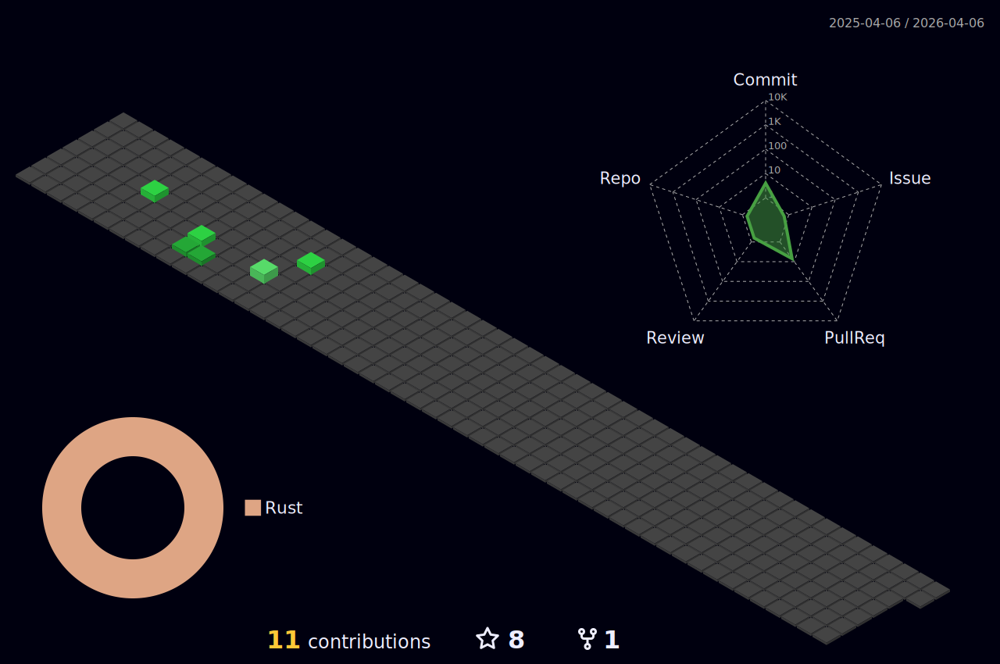
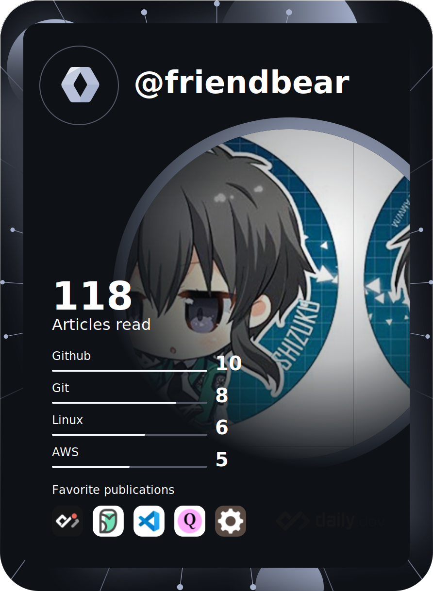

#  

### Hi there （こんにちわ）from Japan :japan: 

<!--x


Mozilla supporter 
## 
-->

<!--

-->

  

---
 ✨ _special_ ✨ repository because its `README.md` (this file) appears on your GitHub profile.


* [QuickAccess Playground](https://wandbox.org/)

<!--
- 🔭 I’m currently working on ...

- 🌱 I’m currently learning [Scala](https://users.scala-lang.org/u/friendbear), [Rustlang](https://users.rust-lang.org/u/friendbear), [Python3](https://pypi.org/user/friendbear) C, C++, .NET and Bigdata, [MongoDB](https://www.mongodb.com/community/forums/u/friendbear) ... etc

---
<a href="https://github.com/sponsors/friendbear" title="Sponsor T Kumagai"></a>
-->

---

<!--
<a href="https://app.daily.dev/friendbear"></a>

- 📫 How to reach me: <a href="mailto:a11mpl0ax@relay.firefox.com">a11mpl0ax@relay.firefox.com</a> is.</p>

- 🔑 GPP Key: F9521D94D71A2F01

-->
<!--

### My link

* [My Mozilla](https://support.mozilla.org/en-US/user/friendbear)
* [IEEE](https://spectrum.ieee.org/u/tomohiro_kumagai)
* [codepen](https://codepen.io/friendbear)
* [Jira](https://friendbear.atlassian.net)
* [Tecnical blog](https://friendbear.hashnode.dev/)
* [StackShare](https://stackshare.io/friendbear)
* [coudcast](https://www.crowdcast.io/friendbear)
* [MyDagsHub]: / https://dagshub.com/friendbear 
* [LFX](https://openprofile.dev/profile/friendbear)

### Trading Profile
- [mql](https://www.mql5.com/ja/users/friendbear)

### Web3 My Profile

- [getcoin](https://gitcoin.co/friendbear)
- [opensea](https://opensea.com/friendbear)

- 👯 I’m looking to collaborate on ...
- 🤔 I’m looking for help with ...
- 💬 Ask me about ...

- 😄 Pronouns: ...
- ⚡ Fun fact: ...

-->

---

### A little more about me...

<details><summary>-</summary>
<p>

#### We can hide anything, even code!

```scala
    #!/usr/bin/env amm
    import scala.io.Source

    trait Programmer{def programinng()}
    trait Engineer{def writting()}
    trait Manager{def communication()}
    trait FullstackEnginner { this: Programmer with Engineer with Manager =>
        def superman()
    }
    class AboutMe(name: String, weightScale: Range, likeLocations: List[String], likeLanguages: List[String])
    object AboutMe {
      def printAbout() {
        println("MyName is ${name}")
      }
      def apply(weightScale: Range, likeLocations: List[String], likeLanguages: List[String]): AboutMe =
        AboutMe(weightScale, likeLocations, likeLanguage)
    }

    type ProgramData = (Int, String, String)
    def loadProgramData(): List[ProgramData] = {
      Source.fromFile("program.csv").getLines.drop(1).map(s => {val split = s.split(',');(split(0).toInt, split(1), split(2))}).toList
    }

    @main
    def printMe() {
      val programData = loadProgramData
      val likeLogic = (like: String) => like match {
        case "hybrid" | "oop" | "functional" | "el" => true
        case _ => false
      }
      val likeLocations = List("Kyoto, Japan", "Shimane, 出雲大社", "Etc.")
      val langs = for (programs <- programData.filter(p => likeLogic(p._3)) yield programs._2
      AboutMe.apply(55 to 79, likeLocations, langs).name = "T Kumagai" printAbout
    }
```
</p>
</details>


## Usefull Link

- [GitHub Markdown Reference](https://github.github.com/gfm/)
- [Open Lab](https://openlab.ncl.ac.uk/)
- [Jupyter](https://jupyter.org/)

<!--
---

<em><b>I love coffee</b> Since 2021-10: open ko-fi shop <a href="https://ko-fi.com/friendbear">Please Access My Coffe Shop.</a>
<a href='https://ko-fi.com/B0B15N77Q' target='_blank'></a>
</em>

---

# Contributions
(in the last 365 days, languages pie based on number of commits)


-->
---

[](https://github.com/friendbear/friendbear/actions/workflows/cronjob-make-snake-picture.yml)

##  Status
[](https://github.com/anuraghazra/github-readme-stats)


[](https://github.com/friendbear/friendbear/actions/workflows/cronjob-wakatime-generater.yml)


<!--START_SECTION:waka-->

```text
From: 28 April 2023 - To: 05 May 2023

No activity tracked
```

<!--END_SECTION:waka-->

<!--
  


  

  

[](https://www.instagram.com/inductor.kela) [](https://blog.inductor.me) 
[](https://speakerdeck.com/inductor)

-->

### Experience

Under constract


<!--
### Skills

   


<p align="left">  </p>

<p algin="center">
<a href="https://dev.to/friendbear"> 
</a>
&emsp;
<a href= "https://instagram.com/friendbear22">
</a>
&emsp;
<a href="https://www.paypal.com/paypalme/friendbear">
</a> 
&emsp;
<a href="https://friendbear.github.io">
</a>
&emsp;
<a href="https://linkedin.com/in/friendbear">
</a>
&emsp;
<a href="https://twitter.com/friendbear22">
</a>
&emsp;
<a href="https://twitter.com/bearsworld22">
</a>
&emsp;
<a href="https://stackoverflow.com/users/10924993/t-kumagai">

&emsp;
<a href="https://community.codenewbie.org/friendbear">
</a>
&emsp;
<a href="https://friendbear.atlassian.net">
</a>
&emsp;


[twitter]: https://twitter.com/friendbear22
[devdojo]: https://devdojo.com/friendbear
[dev.to]: https://dev.to/friendbear
[linkedin]: https://www.linkedin.com/in/friendbear
[stakoverflow]: https://stackoverflow.com/users/10924993/t-kumagai

[](https://twitter.com/friendbear22)
[](https://twitter.com/bearsworld22)

-->
## daily.dev devcard
<a href="https://app.daily.dev/friendbear"></a>


## daily.dev Bookmarks

<!-- daily.dev BOOKMARKS:START -->
- [Top 12 Advanced Git Commands to Know](https://app.daily.dev/posts/CVzlk_pa1?utm_source=rss&utm_medium=bookmarks&utm_campaign=l1Q7lMvCD9ALXzxqEPWaM)
- [Netflix System Design- Backend Architecture](https://app.daily.dev/posts/G2Q_LRrvJ?utm_source=rss&utm_medium=bookmarks&utm_campaign=l1Q7lMvCD9ALXzxqEPWaM)
- [Top 7 Project Management Tools for Developers](https://app.daily.dev/posts/TRVZgIoUF?utm_source=rss&utm_medium=bookmarks&utm_campaign=l1Q7lMvCD9ALXzxqEPWaM)
- [Design Patterns](https://app.daily.dev/posts/MXrfApCkC?utm_source=rss&utm_medium=bookmarks&utm_campaign=l1Q7lMvCD9ALXzxqEPWaM)
- [4 Must-Have Tests for Your Apache Kafka CI/CD with GitHub Actions](https://app.daily.dev/posts/bfiAY8BqH?utm_source=rss&utm_medium=bookmarks&utm_campaign=l1Q7lMvCD9ALXzxqEPWaM)
<!-- daily.dev BOOKMARKS:END -->


## Recent GitHub Activity

<!--START_SECTION:activity-->
`[04/16 10:56]`  Opened issue `#274` in <span title="Private Repo">`🔒friendbear/pocket`</span>  
`[04/01 07:30]`  Made `1` commit in [friendbear/python-begginer](https://github.com/friendbear/python-begginer)  
`[03/22 07:09]`  Starred [dair-ai/Prompt-Engineering-Guide](https://github.com/dair-ai/Prompt-Engineering-Guide)  
`[03/01 05:50]`  Made `1` commit in [friendbear/kafka-beginners](https://github.com/friendbear/kafka-beginners)  
`[03/01 05:50]`  Created branch [`snyk-fix-e7a6fafb44629f8621a7479b938a47c3`](https://github.com/friendbear/kafka-beginners/tree/snyk-fix-e7a6fafb44629f8621a7479b938a47c3) in [friendbear/kafka-beginners](https://github.com/friendbear/kafka-beginners)  
`[02/28 19:16]`  Opened PR [`#17`](https://github.com//friendbear/kafka-beginners/pull/17 '[Snyk] Security upgrade org.yaml:snakeyaml from 1.32 to 2.0') in [friendbear/kafka-beginners](https://github.com/friendbear/kafka-beginners)  
`[02/28 19:16]`  Made `1` commit in [friendbear/kafka-beginners](https://github.com/friendbear/kafka-beginners)  
`[02/28 19:16]`  Created branch [`snyk-fix-9ca93e550f3a23de550f4492a9420ec6`](https://github.com/friendbear/kafka-beginners/tree/snyk-fix-9ca93e550f3a23de550f4492a9420ec6) in [friendbear/kafka-beginners](https://github.com/friendbear/kafka-beginners)  
`[02/13 03:18]`  Made `1` commit in [friendbear/RockScalaForBeginner](https://github.com/friendbear/RockScalaForBeginner)  
`[02/10 04:49]`  Made `1` commit in [friendbear/kafka-beginners-course](https://github.com/friendbear/kafka-beginners-course)  

<details><summary>Show More</summary>

`[02/10 04:49]`  Created branch [`snyk-fix-3cac1da667d4360f2c3ca0fc0272d7d4`](https://github.com/friendbear/kafka-beginners-course/tree/snyk-fix-3cac1da667d4360f2c3ca0fc0272d7d4) in [friendbear/kafka-beginners-course](https://github.com/friendbear/kafka-beginners-course)  
`[02/10 02:17]`  Made `1` commit in [friendbear/kafka-beginners](https://github.com/friendbear/kafka-beginners)  
`[02/10 02:17]`  Created branch [`snyk-fix-36d83788e040431b2df2218b34c9c2fb`](https://github.com/friendbear/kafka-beginners/tree/snyk-fix-36d83788e040431b2df2218b34c9c2fb) in [friendbear/kafka-beginners](https://github.com/friendbear/kafka-beginners)  
`[02/09 21:58]`  Made `1` commit in [friendbear/kafka-beginners](https://github.com/friendbear/kafka-beginners)  
`[02/09 21:58]`  Created branch [`snyk-fix-2d4dcf109eb157999ff113e16f326530`](https://github.com/friendbear/kafka-beginners/tree/snyk-fix-2d4dcf109eb157999ff113e16f326530) in [friendbear/kafka-beginners](https://github.com/friendbear/kafka-beginners)  

</details>
<!--END_SECTION:activity-->


<!--
### [smile](https://smile.amazon.com/hz/wishlist/ls/ref_=wl_list_url_friends_message>>)

Hi, I was wondering if you had built a list on Amazon. I'd love to see what you really want. Could you share your list with me?--

- Wish List [Amazon US](https://amzn.to/3pukpja)
- Wish List [Amazon JP](https://www.amazon.co.jp/hz/wishlist/ls/35H8D193KCE3O)

Thanks!
T Kumagai

To view and share your lists, visit 

<p align="left">

</p>

😙I love Asuna from SAO. 

* host: <https://vercel.com/friendbear>
-->

<!--
[MyLiving](https://en.wikivoyage.org/wiki/Funabashi)

```geojson
{
  "type": "Point",
  "coordinates": [
    0, 0
  ]
}
```
->

<!-- PayPal Logo <table border="0" cellpadding="10" cellspacing="0" align="left"><tr><td align="center"><a href="#" onclick="javascript:window.open('https://www.paypal.com/jp/webapps/mpp/logo/about','olcwhatispaypal','toolbar=no, location=no, directories=no, status=no, menubar=no, scrollbars=yes, resizable=yes, width=900, height=700');"></a></td></tr></table><!-- PayPal Logo -->
-->

[](https://github.com/friendbear/youtube-box/actions/workflows/main.yml)

[](https://wakatime.com/badge/user/c9dffbdd-c073-4c7d-a529-e105c09c8423/project/2860db9f-388b-400c-95ab-51b00dbf7a82)
