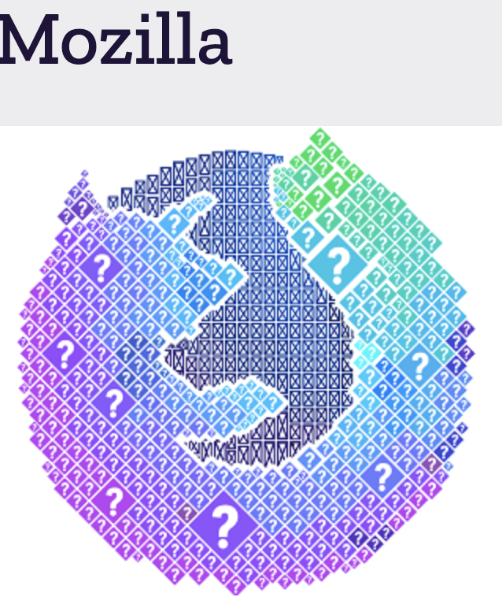

##  friendbear 

<em>
<script async type="text/javascript" data-type="quotes-widget"
    src="https://c.mql5.com/js/widgets/quotes/widget.js?v=1">
      { "type": "ticker", "filter": ["EURUSD", "USDJPY", "GBPUSD", "AUDUSD", "USDCAD", "USDCHF", "NZDUSD"], "width": "100%", "height": 50, "id": "quotesWidgetTicker" }
    </script>
</em>

### Hi there （こんにちわ）from Japan :japan: 

---


Mozilla supporter 
## 
- [My Mozilla profile](https://support.mozilla.org/en-US/user/friendbear)
  

 ✨ _special_ ✨ repository because its `README.md` (this file) appears on your GitHub profile.

[QuickAccess Playground](https://wandbox.org/)
Here are some ideas to get you started:
<!--
- 🔭 I’m currently working on ...
-->
- 🌱 I’m currently learning [Scala](https://users.scala-lang.org/u/friendbear), [Rustlang](https://users.rust-lang.org/u/friendbear), [Python3](https://pypi.org/user/friendbear) C, C++, .NET and Bigdata, [MongoDB](https://www.mongodb.com/community/forums/u/friendbear) ... etc

- 📫 How to reach me: <a href="mailto:s8zmnonun@relay.firefox.com">s8zmnonun@relay.firefox.com</a> is.</p>

- 🔑 GPP Key: F9521D94D71A2F01

[](https://twitter.com/friendbear22)
[](https://twitter.com/bearsworld22)


:doc: [MyDagsHub]: / https://dagshub.com/friendbear "DacsHub"

My QR 


### My owner Twitter Community 🐥

- Let's go out to the ocean.
- [cruise-group](https://twitter.com/i/communities/1498584754915999744)

<!--
- 👯 I’m looking to collaborate on ...
- 🤔 I’m looking for help with ...
- 💬 Ask me about ...

- 😄 Pronouns: ...
- ⚡ Fun fact: ...

-->

### GitHub Markdown Reference
<https://github.github.com/gfm/>

### A little more about me...
```scala
#!/usr/bin/env amm
import scala.io.Source

trait Programmer{def programinng()}
trait Engineer{def writting()}
trait Manager{def communication()}
trait FullstackEnginner { this: Programmer with Engineer with Manager =>
    def superman()
}
class AboutMe(name: String, weightScale: Range, likeLocations: List[String], likeLanguages: List[String])
object AboutMe {
  def printAbout() {
    println("MyName is ${name}")
  }
  def apply(weightScale: Range, likeLocations: List[String], likeLanguages: List[String]): AboutMe =
    AboutMe(weightScale, likeLocations, likeLanguage)
}

type ProgramData = (Int, String, String)
def loadProgramData(): List[ProgramData] = {
  Source.fromFile("program.csv").getLines.drop(1).map(s => {val split = s.split(',');(split(0).toInt, split(1), split(2))}).toList
}

@main
def printMe() {
  val programData = loadProgramData
  val likeLogic = (like: String) => like match {
    case "hybrid" | "oop" | "functional" | "el" => true
    case _ => false
  }
  val likeLocations = List("Kyoto, Japan", "Shimane, 出雲大社", "Etc.")
  val langs = for (programs <- programData.filter(p => likeLogic(p._3)) yield programs._2
  AboutMe.apply(55 to 79, likeLocations, langs).name = "T Kumagai" printAbout
}
```
<em><b>I love coffee</b> Since 2021-10: open ko-fi shop <a href="https://ko-fi.com/friendbear">Please Access My Coffe Shop.</a>
<a href='https://ko-fi.com/B0B15N77Q' target='_blank'></a>
</em>

---
## 日本テクニカルサポートQR CODE
 

---

[](https://github.com/friendbear/friendbear/actions/workflows/cronjob-make-snake-picture.yml)

##  Status
[](https://github.com/anuraghazra/github-readme-stats)


[](https://github.com/friendbear/friendbear/actions/workflows/cronjob-wakatime-generater.yml)


<!--START_SECTION:waka-->

```text
From: 01 March 2022 - To: 08 March 2022

Markdown   2 hrs 11 mins   ███████████████████▒░░░░░   77.08 %
JSON       28 mins         ████░░░░░░░░░░░░░░░░░░░░░   16.57 %
XML        5 mins          ▓░░░░░░░░░░░░░░░░░░░░░░░░   03.26 %
Makefile   3 mins          ▒░░░░░░░░░░░░░░░░░░░░░░░░   01.93 %
YAML       1 min           ▒░░░░░░░░░░░░░░░░░░░░░░░░   00.68 %
HTML       0 secs          ░░░░░░░░░░░░░░░░░░░░░░░░░   00.37 %
```

<!--END_SECTION:waka-->

<!--
  


  

  

[](https://www.instagram.com/inductor.kela) [](https://blog.inductor.me) 
[](https://speakerdeck.com/inductor)
-->

### Experience

Under constract


### Skills

   

<p align="left">  </p>

<p algin="center">
<a href="https://dev.to/friendbear"> 
</a>
&emsp;
<a href= "https://instagram.com/friendbear22">
</a>
&emsp;
<a href="https://www.paypal.com/paypalme/friendbear">
</a> 
&emsp;
<a href="https://friendbear.github.io">
</a>
&emsp;
<a href="https://linkedin.com/in/friendbear">
</a>
&emsp;
<a href="https://twitter.com/friendbear22">
</a>
&emsp;
<a href="https://stackoverflow.com/users/10924993/t-kumagai">

&emsp;


[email]: mailto:s8zmnonun@relay.firefox.com
[twitter]: https://twitter.com/friendbear22
[devdojo]: https://devdojo.com/friendbear
[dev.to]: https://dev.to/friendbear
[linkedin]: https://www.linkedin.com/in/friendbear
[stakoverflow]: https://stackoverflow.com/users/10924993/t-kumagai

## Recent GitHub Activity

<!--START_SECTION:activity-->
`[03/09 02:56]`  Opened issue `#196` in <span title="Private Repo">`🔒friendbear/pocket`</span>  
`[03/08 12:37]`  Starred [gfx-rs/wgpu](https://github.com/gfx-rs/wgpu)  
`[03/08 12:33]`  Starred [lapce/lapce](https://github.com/lapce/lapce)  
`[03/08 12:32]`  Starred [xi-editor/xi-editor](https://github.com/xi-editor/xi-editor)  
`[03/08 12:31]`  Starred [linebender/druid](https://github.com/linebender/druid)  
`[03/08 11:13]`  Starred [getsentry/sentry-java](https://github.com/getsentry/sentry-java)  
`[03/08 09:00]`  Starred [Excited-ccccly/markdown-mail](https://github.com/Excited-ccccly/markdown-mail)  
`[03/08 08:35]`  Made `1` commit in [cruise-group/cruise-group](https://github.com/cruise-group/cruise-group)  
`[03/08 08:23]`  Starred [discord/workers-rs](https://github.com/discord/workers-rs)  
`[03/08 04:00]`  Made `2` commits in [cruise-group/.github](https://github.com/cruise-group/.github)  

<details><summary>Show More</summary>

`[03/08 03:36]`  Made `3` commits in [friendbear/friendbear.github.io](https://github.com/friendbear/friendbear.github.io)  
`[03/07 17:53]`  Starred [hyperpayorg/hardwallet](https://github.com/hyperpayorg/hardwallet)  
`[03/07 17:36]`  Starred [PolyMeilex/Neothesia](https://github.com/PolyMeilex/Neothesia)  
`[03/07 16:33]`  Made `1` commit in [cruise-group/.github](https://github.com/cruise-group/.github)  
`[03/07 15:46]`  Starred [DioxusLabs/dioxus](https://github.com/DioxusLabs/dioxus)  
`[03/07 13:56]`  Opened issue `#195` in <span title="Private Repo">`🔒friendbear/pocket`</span>  
`[03/07 09:46]`  Made `1` commit in [friendbear/friendbear.github.io](https://github.com/friendbear/friendbear.github.io)  
`[03/07 06:05]`  Starred [billw2/rpi-clone](https://github.com/billw2/rpi-clone)  
`[03/07 05:59]`  Made `1` commit in [friendbear/friendbear](https://github.com/friendbear/friendbear)  
`[03/07 05:56]`  Opened issue `#194` in <span title="Private Repo">`🔒friendbear/pocket`</span>  
`[03/06 20:54]`  Starred [dtolnay/cxx](https://github.com/dtolnay/cxx)  
`[03/06 11:36]`  Starred [ciniml/rust-dap](https://github.com/ciniml/rust-dap)  
`[03/06 09:27]`  Starred [serenity-rs/serenity](https://github.com/serenity-rs/serenity)  
`[03/06 06:56]`  Opened issue `#193` in <span title="Private Repo">`🔒friendbear/pocket`</span>  
`[03/05 23:32]`  Made `1` commit in [friendbear/friendbear](https://github.com/friendbear/friendbear)  
`[03/05 22:56]`  Opened issue `#192` in <span title="Private Repo">`🔒friendbear/pocket`</span>  
`[03/05 07:56]`  Opened issue `#191` in <span title="Private Repo">`🔒friendbear/pocket`</span>  
`[03/05 07:37]`  Starred [pola-rs/polars](https://github.com/pola-rs/polars)  
`[03/05 02:19]`  Made `3` commits in [friendbear/friendbear](https://github.com/friendbear/friendbear)  
`[03/04 16:14]`  Forked [diablinux/jupyter-notebooks-collection](https://github.com/diablinux/jupyter-notebooks-collection) to [friendbear/jupyter-notebooks-collection](https://github.com/friendbear/jupyter-notebooks-collection)  
`[03/04 11:34]`  Made `2` commits in [friendbear/friendbear](https://github.com/friendbear/friendbear)  
`[03/04 09:56]`  Opened issue `#190` in <span title="Private Repo">`🔒friendbear/pocket`</span>  
`[03/04 09:49]`  Forked [conduktor/kafka-stack-docker-compose](https://github.com/conduktor/kafka-stack-docker-compose) to [friendbear/kafka-stack-docker-compose](https://github.com/friendbear/kafka-stack-docker-compose)  
`[03/04 07:54]`  Made `3` commits in [friendbear/friendbear.github.io](https://github.com/friendbear/friendbear.github.io)  
`[03/04 07:30]`  Made `4` commits in [friendbear/friendbear](https://github.com/friendbear/friendbear)  
`[03/04 00:11]`  Starred [microsoft/winget-cli](https://github.com/microsoft/winget-cli)  
`[03/03 20:10]`  Made `1` commit in [friendbear/friendbear](https://github.com/friendbear/friendbear)  
`[03/03 13:45]`  Starred [openjdk/jdk](https://github.com/openjdk/jdk)  
`[03/03 11:08]`  Made `1` commit in [friendbear/friendbear](https://github.com/friendbear/friendbear)  
`[03/03 09:56]`  Opened issue `#189` in <span title="Private Repo">`🔒friendbear/pocket`</span>  
`[03/03 06:17]`  Starred [wasmerio/wasmer-python](https://github.com/wasmerio/wasmer-python)  
`[03/03 03:56]`  Made `2` commits in [friendbear/friendbear.github.io](https://github.com/friendbear/friendbear.github.io)  
`[03/03 00:13]`  Made `1` commit in [friendbear/friendbear](https://github.com/friendbear/friendbear)  
`[03/02 15:56]`  Opened issue `#187` in <span title="Private Repo">`🔒friendbear/pocket`</span>  
`[03/02 15:56]`  Opened issue `#188` in <span title="Private Repo">`🔒friendbear/pocket`</span>  
`[03/02 14:23]`  Starred [poketwo/poketwo](https://github.com/poketwo/poketwo)  
`[03/02 13:57]`  Made `1` commit in [friendbear/friendbear](https://github.com/friendbear/friendbear)  
`[03/02 08:29]`  Made `1` commit in [friendbear/friendbear.github.io](https://github.com/friendbear/friendbear.github.io)  
`[03/02 06:56]`  Opened issue `#186` in <span title="Private Repo">`🔒friendbear/pocket`</span>  
`[03/02 05:28]`  Made `1` commit in [cruise-group/.github](https://github.com/cruise-group/.github)  
`[03/02 04:33]`  Commented on [`db5f2e8`](https://github.com/cruise-group/cruise-group/commit/db5f2e8e5985418dc2000af7a4d6f362f9b05f4c#commitcomment-67760658) in [cruise-group/cruise-group](https://github.com/cruise-group/cruise-group)  
`[03/02 04:31]`  Made `1` commit in [cruise-group/cruise-group](https://github.com/cruise-group/cruise-group)  
`[03/02 04:31]`  Created branch [`gh-pages`](https://github.com/cruise-group/cruise-group/tree/gh-pages) in [cruise-group/cruise-group](https://github.com/cruise-group/cruise-group)  
`[03/02 04:30]`  Created branch [`main`](https://github.com/cruise-group/cruise-group/tree/main) in [cruise-group/cruise-group](https://github.com/cruise-group/cruise-group)  
`[03/02 04:30]`  Created repository [cruise-group/cruise-group](https://github.com/cruise-group/cruise-group)  
`[03/02 03:57]`  Made `1` commit in [cruise-group/.github](https://github.com/cruise-group/.github)  
`[03/02 03:14]`  Made `1` commit in [friendbear/friendbear](https://github.com/friendbear/friendbear)  
`[03/02 00:56]`  Opened issue `#185` in <span title="Private Repo">`🔒friendbear/pocket`</span>  
`[03/01 09:48]`  Made `1` commit in [friendbear/friendbear.github.io](https://github.com/friendbear/friendbear.github.io)  
`[03/01 02:57]`  Made `1` commit in [friendbear/friendbear](https://github.com/friendbear/friendbear)  
`[02/27 12:56]`  Opened issue `#184` in <span title="Private Repo">`🔒friendbear/pocket`</span>  
`[02/27 11:56]`  Opened issue `#183` in <span title="Private Repo">`🔒friendbear/pocket`</span>  
`[02/27 07:15]`  Made `1` commit in [friendbear/twitter-followers](https://github.com/friendbear/twitter-followers)  
`[02/27 02:56]`  Opened issue `#182` in <span title="Private Repo">`🔒friendbear/pocket`</span>  
`[02/26 03:56]`  Opened issue `#181` in <span title="Private Repo">`🔒friendbear/pocket`</span>  
`[02/26 03:20]`  Opened issue [`#954`](https://github.com//Rigellute/spotify-tui/issues/954 'About changing the redirect URL.') in [Rigellute/spotify-tui](https://github.com/Rigellute/spotify-tui)  
`[02/26 00:40]`  Starred [Rigellute/spotify-tui](https://github.com/Rigellute/spotify-tui)  
`[02/25 15:09]`  Starred [paritytech/scripts](https://github.com/paritytech/scripts)  
`[02/25 04:56]`  Opened issue `#180` in <span title="Private Repo">`🔒friendbear/pocket`</span>  
`[02/24 07:56]`  Opened issue `#179` in <span title="Private Repo">`🔒friendbear/pocket`</span>  
`[02/23 02:33]`  Made `1` commit in [friendbear/friendbear](https://github.com/friendbear/friendbear)  
`[02/23 02:24]`  Made `3` commits in [friendbear/python-begginer](https://github.com/friendbear/python-begginer)  
`[02/22 23:13]`  Starred [PaulJuliusMartinez/jless](https://github.com/PaulJuliusMartinez/jless)  
`[02/22 00:56]`  Opened issue `#178` in <span title="Private Repo">`🔒friendbear/pocket`</span>  
`[02/21 04:17]`  Made `3` commits in [friendbear/python-begginer](https://github.com/friendbear/python-begginer)  
`[02/18 05:56]`  Opened issue `#177` in <span title="Private Repo">`🔒friendbear/pocket`</span>  
`[02/18 04:57]`  Opened issue `#176` in <span title="Private Repo">`🔒friendbear/pocket`</span>  
`[02/18 01:59]`  Made `14` commits in [friendbear/python-begginer](https://github.com/friendbear/python-begginer)  
`[02/15 03:55]`  Starred [wurstmeister/kafka-docker](https://github.com/wurstmeister/kafka-docker)  
`[02/14 09:28]`  Closed issue [`#1`](https://github.com//friendbear/rust-programming-recipes/issues/1 '[Section1]Handling All Kinds of Errors with Result and option') in [friendbear/rust-programming-recipes](https://github.com/friendbear/rust-programming-recipes)  
`[02/14 09:27]`  Commented on [`#1`](https://github.com//friendbear/rust-programming-recipes/issues/1 '[Section1]Handling All Kinds of Errors with Result and option') in [friendbear/rust-programming-recipes](https://github.com/friendbear/rust-programming-recipes)  
`[02/14 08:56]`  Opened issue `#175` in <span title="Private Repo">`🔒friendbear/pocket`</span>  
`[02/14 06:56]`  Opened issue `#174` in <span title="Private Repo">`🔒friendbear/pocket`</span>  
`[02/06 10:35]`  Commented on [`#1`](https://github.com//friendbear/rust-programming-recipes/issues/1 '[Section1]Handling All Kinds of Errors with Result and option') in [friendbear/rust-programming-recipes](https://github.com/friendbear/rust-programming-recipes)  
`[02/06 10:34]`  Commented on [`#5`](https://github.com//friendbear/rust-programming-recipes/issues/5 'Introducting the Failure Crate') in [friendbear/rust-programming-recipes](https://github.com/friendbear/rust-programming-recipes)  
`[02/06 10:24]`  Merged PR [`#5`](https://github.com//friendbear/rust-programming-recipes/pull/5 'Introducting the Failure Crate') in [friendbear/rust-programming-recipes](https://github.com/friendbear/rust-programming-recipes)  
`[02/06 10:24]`  Made `2` commits in [friendbear/rust-programming-recipes](https://github.com/friendbear/rust-programming-recipes)  
`[02/06 10:24]`  Opened PR [`#5`](https://github.com//friendbear/rust-programming-recipes/pull/5 'Introducting the Failure Crate') in [friendbear/rust-programming-recipes](https://github.com/friendbear/rust-programming-recipes)  
`[02/06 10:24]`  Made `1` commit in [friendbear/rust-programming-recipes](https://github.com/friendbear/rust-programming-recipes)  
`[02/06 08:27]`  Made `1` commit in [friendbear/dotfiles](https://github.com/friendbear/dotfiles)  
`[02/06 06:35]`  Made `2` commits in [friendbear/rust-programming-recipes](https://github.com/friendbear/rust-programming-recipes)  
`[02/06 06:35]`  Merged PR [`#4`](https://github.com//friendbear/rust-programming-recipes/pull/4 'typo.') in [friendbear/rust-programming-recipes](https://github.com/friendbear/rust-programming-recipes)  
`[02/06 06:35]`  Opened PR [`#4`](https://github.com//friendbear/rust-programming-recipes/pull/4 'typo.') in [friendbear/rust-programming-recipes](https://github.com/friendbear/rust-programming-recipes)  
`[02/06 06:31]`  Made `1` commit in [friendbear/rust-programming-recipes](https://github.com/friendbear/rust-programming-recipes)  
`[01/31 00:12]`  Starred [confluentinc/cp-demo](https://github.com/confluentinc/cp-demo)  
`[01/31 00:11]`  Starred [confluentinc/kafka-streams-examples](https://github.com/confluentinc/kafka-streams-examples)  
`[01/31 00:11]`  Starred [sayanarijit/xplr](https://github.com/sayanarijit/xplr)  
`[01/25 08:56]`  Opened issue `#173` in <span title="Private Repo">`🔒friendbear/pocket`</span>  
`[01/08 10:53]`  Made `3` commits in [friendbear/rust-programming-recipes](https://github.com/friendbear/rust-programming-recipes)  
`[01/08 10:53]`  Merged PR [`#3`](https://github.com//friendbear/rust-programming-recipes/pull/3 'Develop') in [friendbear/rust-programming-recipes](https://github.com/friendbear/rust-programming-recipes)  
`[01/08 10:53]`  Opened PR [`#3`](https://github.com//friendbear/rust-programming-recipes/pull/3 'Develop') in [friendbear/rust-programming-recipes](https://github.com/friendbear/rust-programming-recipes)  
`[01/08 10:52]`  Made `6` commits in [friendbear/rust-programming-recipes](https://github.com/friendbear/rust-programming-recipes)  
`[01/06 06:29]`  Merged PR [`#2`](https://github.com//friendbear/rust-programming-recipes/pull/2 'Develop') in [friendbear/rust-programming-recipes](https://github.com/friendbear/rust-programming-recipes)  
`[01/06 06:29]`  Opened PR [`#2`](https://github.com//friendbear/rust-programming-recipes/pull/2 'Develop') in [friendbear/rust-programming-recipes](https://github.com/friendbear/rust-programming-recipes)  
`[01/06 06:23]`  Made `2` commits in [friendbear/rust-programming-recipes](https://github.com/friendbear/rust-programming-recipes)  
`[01/06 04:29]`  Created branch [`develop`](https://github.com/friendbear/rust-programming-recipes/tree/develop) in [friendbear/rust-programming-recipes](https://github.com/friendbear/rust-programming-recipes)  
`[01/06 04:11]`  Opened issue [`#1`](https://github.com//friendbear/rust-programming-recipes/issues/1 '[Section1]Handling All Kinds of Errors with Result and zoption') in [friendbear/rust-programming-recipes](https://github.com/friendbear/rust-programming-recipes)  
`[01/06 04:04]`  Made `3` commits in [friendbear/rust-programming-recipes](https://github.com/friendbear/rust-programming-recipes)  
`[01/03 02:49]`  Starred [PacktPublishing/Rust-Programming-Recipies](https://github.com/PacktPublishing/Rust-Programming-Recipies)  
`[01/03 02:46]`  Created branch [`main`](https://github.com/friendbear/rust-programming-recipes/tree/main) in [friendbear/rust-programming-recipes](https://github.com/friendbear/rust-programming-recipes)  
`[01/03 02:46]`  Created repository [friendbear/rust-programming-recipes](https://github.com/friendbear/rust-programming-recipes)  
`[01/03 02:44]`  Created branch [`main`](https://github.com/friendbear/rust-programming-recipes/tree/main) in [friendbear/rust-programming-recipes](https://github.com/friendbear/rust-programming-recipes)  
`[01/03 02:44]`  Created repository [friendbear/rust-programming-recipes](https://github.com/friendbear/rust-programming-recipes)  
`[01/03 02:02]`  Starred [rust-lang/rust](https://github.com/rust-lang/rust)  
`[12/28 00:59]`  Starred [hyperium/hyper](https://github.com/hyperium/hyper)  
`[12/28 00:43]`  Starred [rustdesk/rustdesk](https://github.com/rustdesk/rustdesk)  
`[12/28 00:37]`  Starred [confluentinc/examples](https://github.com/confluentinc/examples)  
`[12/26 19:34]`  Starred [rust-unofficial/awesome-rust](https://github.com/rust-unofficial/awesome-rust)  
`[12/25 03:13]`  Starred [spinscale/elasticsearch-ingest-opennlp](https://github.com/spinscale/elasticsearch-ingest-opennlp)  
`[12/24 20:49]`  Starred [sickcodes/Docker-OSX](https://github.com/sickcodes/Docker-OSX)  
`[12/24 20:19]`  Starred [saitoha/libsixel](https://github.com/saitoha/libsixel)  
`[12/24 10:56]`  Opened issue `#172` in <span title="Private Repo">`🔒friendbear/pocket`</span>  
`[12/21 00:47]`  Starred [spring-projects/spring-kafka](https://github.com/spring-projects/spring-kafka)  
`[12/19 07:56]`  Opened issue `#171` in <span title="Private Repo">`🔒friendbear/pocket`</span>  
`[12/17 22:52]`  Made `1` commit in [friendbear/kafka-beginners](https://github.com/friendbear/kafka-beginners)  
`[12/17 05:58]`  Starred [cantino/mcfly](https://github.com/cantino/mcfly)  
`[12/16 10:00]`  Made `1` commit in [friendbear/auth-service](https://github.com/friendbear/auth-service)  
`[12/16 09:58]`  Created branch [`diesel-discussions-2979`](https://github.com/friendbear/auth-service/tree/diesel-discussions-2979) in [friendbear/auth-service](https://github.com/friendbear/auth-service)  
`[12/16 05:31]`  Created branch [`main`](https://github.com/friendbear/diesel-db-posts-sample/tree/main) in [friendbear/diesel-db-posts-sample](https://github.com/friendbear/diesel-db-posts-sample)  
`[12/16 05:31]`  Created repository [friendbear/diesel-db-posts-sample](https://github.com/friendbear/diesel-db-posts-sample)  
`[12/16 05:27]`  Made `1` commit in [friendbear/auth-service](https://github.com/friendbear/auth-service)  
`[12/16 01:04]`  Starred [diesel-rs/diesel](https://github.com/diesel-rs/diesel)  
`[12/15 18:56]`  Opened issue `#170` in <span title="Private Repo">`🔒friendbear/pocket`</span>  
`[12/15 17:54]`  Made `4` commits in [friendbear/auth-service](https://github.com/friendbear/auth-service)  
`[12/15 07:53]`  Created branch [`main`](https://github.com/friendbear/auth-service/tree/main) in [friendbear/auth-service](https://github.com/friendbear/auth-service)  
`[12/15 07:49]`  Created repository [friendbear/auth-service](https://github.com/friendbear/auth-service)  
`[12/15 07:40]`  Made `1` commit in [friendbear/iriam-event](https://github.com/friendbear/iriam-event)  
`[12/14 22:09]`  Made `1` commit in [friendbear/dotfiles](https://github.com/friendbear/dotfiles)  
`[12/14 00:56]`  Opened issue `#169` in <span title="Private Repo">`🔒friendbear/pocket`</span>  
`[12/13 13:49]`  Made `3` commits in [friendbear/kafka-beginners](https://github.com/friendbear/kafka-beginners)  
`[12/10 10:56]`  Opened issue `#168` in <span title="Private Repo">`🔒friendbear/pocket`</span>  
`[12/09 11:19]`  Forked [TechnocratSid/elastic-twitter-canvas](https://github.com/TechnocratSid/elastic-twitter-canvas) to [friendbear/elastic-twitter-canvas](https://github.com/friendbear/elastic-twitter-canvas)  

</details>
<!--END_SECTION:activity-->

<!--END-SECTION:activity-->

### [smile](https://smile.amazon.com/hz/wishlist/ls/ref_=wl_list_url_friends_message>>)

Hi, I was wondering if you had built a list on Amazon. I'd love to see what you really want. Could you share your list with me?--

- Wish List [Amazon](https://amzn.to/3pukpja)

Thanks!
T Kumagai

To view and share your lists, visit 

<p align="left">

<!--
[](https://ko-fi.com/B0B15N77Q)
-->
</p>

😙I love Asuna from SAO. 

<iframe width="600" height="600" src="https://ionicabizau.github.io/github-profile-languages/api.html?@friendbear" frameborder="0"></iframe>

<!-- PayPal Logo --><table border="0" cellpadding="10" cellspacing="0" align="left"><tr><td align="center"><a href="#" onclick="javascript:window.open('https://www.paypal.com/jp/webapps/mpp/logo/about','olcwhatispaypal','toolbar=no, location=no, directories=no, status=no, menubar=no, scrollbars=yes, resizable=yes, width=900, height=700');"></a></td></tr></table><!-- PayPal Logo -->

[](https://github.com/friendbear/youtube-box/actions/workflows/main.yml)

[](https://wakatime.com/badge/user/c9dffbdd-c073-4c7d-a529-e105c09c8423/project/2860db9f-388b-400c-95ab-51b00dbf7a82)

