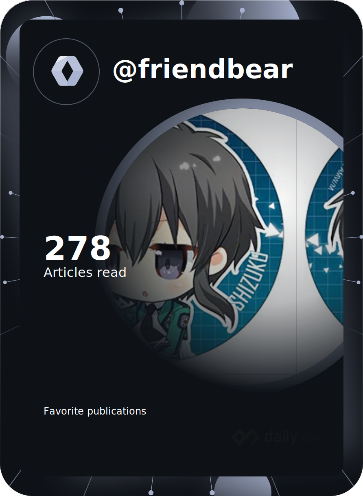

#  friendbear 

### Hi there （こんにちわ）from Japan :japan: 


---
<!--x


Mozilla supporter 
## 
-->

<!--

-->

- [My Mozilla profile](https://support.mozilla.org/en-US/user/friendbear)
  

---
 ✨ _special_ ✨ repository because its `README.md` (this file) appears on your GitHub profile.


[QuickAccess Playground](https://wandbox.org/)
Here are some ideas to get you started:
<!--
- 🔭 I’m currently working on ...
-->
- 🌱 I’m currently learning [Scala](https://users.scala-lang.org/u/friendbear), [Rustlang](https://users.rust-lang.org/u/friendbear), [Python3](https://pypi.org/user/friendbear) C, C++, .NET and Bigdata, [MongoDB](https://www.mongodb.com/community/forums/u/friendbear) ... etc

---
<a href="https://github.com/sponsors/friendbear" title="Sponsor T Kumagai"></a>

---

<!--
<a href="https://app.daily.dev/friendbear"></a>

- 📫 How to reach me: <a href="mailto:a11mpl0ax@relay.firefox.com">a11mpl0ax@relay.firefox.com</a> is.</p>

- 🔑 GPP Key: F9521D94D71A2F01

-->

### My link

* [IEEE](https://spectrum.ieee.org/u/tomohiro_kumagai)
* [codepen](https://codepen.io/friendbear)
* [Jira](https://friendbear.atlassian.net)
* [Tecnical blog](https://friendbear.hashnode.dev/)
* [StackShare](https://stackshare.io/friendbear)
* [coudcast](https://www.crowdcast.io/friendbear)
* [MyDagsHub]: / https://dagshub.com/friendbear 
* [LFX](https://openprofile.dev/profile/friendbear)

### Trading Profile
- [mql](https://www.mql5.com/ja/users/friendbear)

### Web3 My Profile

- [getcoin](https://gitcoin.co/friendbear)
- [opensea](https://opensea.com/friendbear)

<!--
- 👯 I’m looking to collaborate on ...
- 🤔 I’m looking for help with ...
- 💬 Ask me about ...

- 😄 Pronouns: ...
- ⚡ Fun fact: ...

-->

---

### A little more about me...

<details><summary>CLICK ME</summary>
<p>

#### We can hide anything, even code!

```scala
    #!/usr/bin/env amm
    import scala.io.Source

    trait Programmer{def programinng()}
    trait Engineer{def writting()}
    trait Manager{def communication()}
    trait FullstackEnginner { this: Programmer with Engineer with Manager =>
        def superman()
    }
    class AboutMe(name: String, weightScale: Range, likeLocations: List[String], likeLanguages: List[String])
    object AboutMe {
      def printAbout() {
        println("MyName is ${name}")
      }
      def apply(weightScale: Range, likeLocations: List[String], likeLanguages: List[String]): AboutMe =
        AboutMe(weightScale, likeLocations, likeLanguage)
    }

    type ProgramData = (Int, String, String)
    def loadProgramData(): List[ProgramData] = {
      Source.fromFile("program.csv").getLines.drop(1).map(s => {val split = s.split(',');(split(0).toInt, split(1), split(2))}).toList
    }

    @main
    def printMe() {
      val programData = loadProgramData
      val likeLogic = (like: String) => like match {
        case "hybrid" | "oop" | "functional" | "el" => true
        case _ => false
      }
      val likeLocations = List("Kyoto, Japan", "Shimane, 出雲大社", "Etc.")
      val langs = for (programs <- programData.filter(p => likeLogic(p._3)) yield programs._2
      AboutMe.apply(55 to 79, likeLocations, langs).name = "T Kumagai" printAbout
    }
```
</p>
</details>

---

<em><b>I love coffee</b> Since 2021-10: open ko-fi shop <a href="https://ko-fi.com/friendbear">Please Access My Coffe Shop.</a>
<a href='https://ko-fi.com/B0B15N77Q' target='_blank'></a>
</em>

---

## Usefull Link

- [GitHub Markdown Reference](https://github.github.com/gfm/)
- [Open Lab](https://openlab.ncl.ac.uk/)
- [Jupyter](https://jupyter.org/)


# Contributions
(in the last 365 days, languages pie based on number of commits)


---

[](https://github.com/friendbear/friendbear/actions/workflows/cronjob-make-snake-picture.yml)

##  Status
[](https://github.com/anuraghazra/github-readme-stats)


[](https://github.com/friendbear/friendbear/actions/workflows/cronjob-wakatime-generater.yml)


<!--START_SECTION:waka-->

```text
No activity tracked
```

<!--END_SECTION:waka-->

<!--
  


  

  

[](https://www.instagram.com/inductor.kela) [](https://blog.inductor.me) 
[](https://speakerdeck.com/inductor)

-->

### Experience

Under constract


<!--
### Skills

   
-->

<p align="left">  </p>

<p algin="center">
<a href="https://dev.to/friendbear"> 
</a>
&emsp;
<a href= "https://instagram.com/friendbear22">
</a>
&emsp;
<a href="https://www.paypal.com/paypalme/friendbear">
</a> 
&emsp;
<a href="https://friendbear.github.io">
</a>
&emsp;
<a href="https://linkedin.com/in/friendbear">
</a>
&emsp;
<a href="https://twitter.com/friendbear22">
</a>
&emsp;
<a href="https://twitter.com/bearsworld22">
</a>
&emsp;
<a href="https://stackoverflow.com/users/10924993/t-kumagai">

&emsp;
<a href="https://community.codenewbie.org/friendbear">
</a>
&emsp;
<a href="https://friendbear.atlassian.net">
</a>
&emsp;


[twitter]: https://twitter.com/friendbear22
[devdojo]: https://devdojo.com/friendbear
[dev.to]: https://dev.to/friendbear
[linkedin]: https://www.linkedin.com/in/friendbear
[stakoverflow]: https://stackoverflow.com/users/10924993/t-kumagai

[](https://twitter.com/friendbear22)
[](https://twitter.com/bearsworld22)


# daily.dev devcard
<a href="https://app.daily.dev/friendbear"></a>


## daily.dev Bookmarks

<!-- daily.dev BOOKMARKS:START -->
- [Remote development with Rust on fly.io](https://app.daily.dev/posts/alKOGIlhn?utm_source=rss&utm_medium=bookmarks&utm_campaign=l1Q7lMvCD9ALXzxqEPWaM)
- [Self Host Your Own Website for Free](https://app.daily.dev/posts/O7VFpc9xO?utm_source=rss&utm_medium=bookmarks&utm_campaign=l1Q7lMvCD9ALXzxqEPWaM)
- [5 VSCode Extensions You Must Use](https://app.daily.dev/posts/VcVWZ7Aus?utm_source=rss&utm_medium=bookmarks&utm_campaign=l1Q7lMvCD9ALXzxqEPWaM)
- [How to Find a Vulnerability in a Website](https://app.daily.dev/posts/95Ay6SowM?utm_source=rss&utm_medium=bookmarks&utm_campaign=l1Q7lMvCD9ALXzxqEPWaM)
- [When to use GraphQL, gRPC, REST, and Webhooks](https://app.daily.dev/posts/72aN_B27u?utm_source=rss&utm_medium=bookmarks&utm_campaign=l1Q7lMvCD9ALXzxqEPWaM)
<!-- daily.dev BOOKMARKS:END -->


## Recent GitHub Activity

<!--START_SECTION:activity-->
`[08/25 00:08]`  Opened issue `#266` in <span title="Private Repo">`🔒friendbear/pocket`</span>  
`[08/22 04:56]`  Opened issue `#265` in <span title="Private Repo">`🔒friendbear/pocket`</span>  
`[08/22 00:56]`  Opened issue `#264` in <span title="Private Repo">`🔒friendbear/pocket`</span>  
`[08/20 05:49]`  Made `3` commits in [friendbear/auth-service](https://github.com/friendbear/auth-service)  
`[08/20 05:20]`  Commented on [`#2`](https://github.com//friendbear/auth-service/issues/2 'Invitation API Response Error.') in [friendbear/auth-service](https://github.com/friendbear/auth-service)  
`[08/20 04:51]`  Made `1` commit in [friendbear/auth-service](https://github.com/friendbear/auth-service)  
`[08/20 04:50]`  Opened issue [`#2`](https://github.com//friendbear/auth-service/issues/2 'Invitation API Response Error.') in [friendbear/auth-service](https://github.com/friendbear/auth-service)  
`[08/20 03:13]`  Made `3` commits in [friendbear/programming-rust](https://github.com/friendbear/programming-rust)  
`[08/16 07:28]`  Made `2` commits in [friendbear/auth-service](https://github.com/friendbear/auth-service)  
`[08/09 16:16]`  Starred [conduktor/kafka-beginners-course](https://github.com/conduktor/kafka-beginners-course)  

<details><summary>Show More</summary>

`[08/09 01:36]`  Made `7` commits in [friendbear/programming-rust](https://github.com/friendbear/programming-rust)  
`[08/04 17:27]`  Starred [WerWolv/ImHex](https://github.com/WerWolv/ImHex)  
`[08/04 08:02]`  Made `6` commits in [friendbear/auth-service](https://github.com/friendbear/auth-service)  
`[08/04 04:34]`  Merged PR [`#1`](https://github.com//friendbear/auth-service/pull/1 'Bump regex from 1.5.4 to 1.5.6') in [friendbear/auth-service](https://github.com/friendbear/auth-service)  
`[08/04 04:14]`  Made `5` commits in [friendbear/programming-rust](https://github.com/friendbear/programming-rust)  
`[08/02 07:06]`  Starred [pretzelhammer/rust-blog](https://github.com/pretzelhammer/rust-blog)  
`[08/02 05:42]`  Made `20` commits in [friendbear/programming-rust](https://github.com/friendbear/programming-rust)  
`[07/28 09:52]`  Deleted `dependabot/cargo/chapter2/mandelbrot/image-0.23.12` from [friendbear/programming-rust](https://github.com/friendbear/programming-rust)  
`[07/28 09:52]`  Made `2` commits in [friendbear/programming-rust](https://github.com/friendbear/programming-rust)  
`[07/28 09:52]`  Merged PR [`#1`](https://github.com//friendbear/programming-rust/pull/1 'Bump image from 0.13.0 to 0.23.12 in /chapter2/mandelbrot') in [friendbear/programming-rust](https://github.com/friendbear/programming-rust)  
`[07/28 04:13]`  Made `14` commits in [friendbear/programming-rust](https://github.com/friendbear/programming-rust)  
`[07/20 05:44]`  Starred [natemoo-re/natemoo-re](https://github.com/natemoo-re/natemoo-re)  
`[07/14 11:31]`  Opened issue [`#1`](https://github.com//friendbear/springboot-kafka-real-world-project/issues/1 'c.launchdarkly.eventsource.EventSource   : Caught unexpected error from EventHandler: org.apache.kafka.common.KafkaException: Failed to construct kafka producer.') in [friendbear/springboot-kafka-real-world-project](https://github.com/friendbear/springboot-kafka-real-world-project)  
`[07/14 11:28]`  Made `1` commit in [friendbear/springboot-kafka-real-world-project](https://github.com/friendbear/springboot-kafka-real-world-project)  
`[07/14 11:27]`  Created branch [`main`](https://github.com/friendbear/springboot-kafka-real-world-project/tree/main) in [friendbear/springboot-kafka-real-world-project](https://github.com/friendbear/springboot-kafka-real-world-project)  
`[07/14 11:26]`  Created repository [friendbear/springboot-kafka-real-world-project](https://github.com/friendbear/springboot-kafka-real-world-project)  
`[07/14 06:39]`  Made `2` commits in [friendbear/programming-rust](https://github.com/friendbear/programming-rust)  
`[07/14 03:13]`  Made `1` commit in [friendbear/dotfiles](https://github.com/friendbear/dotfiles)  
`[07/13 14:55]`  Starred [MS-WEB-BN/c41n](https://github.com/MS-WEB-BN/c41n)  
`[07/13 09:56]`  Opened issue `#263` in <span title="Private Repo">`🔒friendbear/pocket`</span>  
`[07/13 08:16]`  Made `2` commits in [friendbear/programming-rust](https://github.com/friendbear/programming-rust)  
`[07/13 03:33]`  Starred [clauswilke/dataviz](https://github.com/clauswilke/dataviz)  
`[07/06 12:56]`  Opened issue `#262` in <span title="Private Repo">`🔒friendbear/pocket`</span>  
`[07/06 05:42]`  Starred [saubury/plane-kafka](https://github.com/saubury/plane-kafka)  
`[07/05 22:51]`  Deleted `dependabot/bundler/nokogiri-1.13.6` from [friendbear/slackthemes](https://github.com/friendbear/slackthemes)  
`[07/05 22:51]`  Made `2` commits in [friendbear/slackthemes](https://github.com/friendbear/slackthemes)  
`[07/05 22:51]`  Merged PR [`#1`](https://github.com//friendbear/slackthemes/pull/1 'Bump nokogiri from 1.6.6.2 to 1.13.6') in [friendbear/slackthemes](https://github.com/friendbear/slackthemes)  
`[07/05 22:49]`  Deleted `dependabot/npm_and_yarn/moment-2.29.3` from <span title="Private Repo">`🔒friendbear/gatsby`</span>  
`[07/05 22:49]`  Made `2` commits in <span title="Private Repo">`🔒friendbear/gatsby`</span>  
`[07/05 22:49]`  Merged PR `#1` in <span title="Private Repo">`🔒friendbear/gatsby`</span>  
`[07/05 22:49]`  Deleted `dependabot/npm_and_yarn/devcert-1.2.1` from <span title="Private Repo">`🔒friendbear/gatsby`</span>  
`[07/05 22:49]`  Made `2` commits in <span title="Private Repo">`🔒friendbear/gatsby`</span>  
`[07/05 22:49]`  Merged PR `#2` in <span title="Private Repo">`🔒friendbear/gatsby`</span>  
`[07/05 02:08]`  Starred [lensesio/fast-data-dev](https://github.com/lensesio/fast-data-dev)  
`[07/05 01:28]`  Made `1` commit in [friendbear/kafka-connect](https://github.com/friendbear/kafka-connect)  
`[07/04 05:28]`  Starred [Eneco/kafka-connect-twitter](https://github.com/Eneco/kafka-connect-twitter)  
`[07/04 05:18]`  Created branch [`main`](https://github.com/friendbear/kafka-connect/tree/main) in [friendbear/kafka-connect](https://github.com/friendbear/kafka-connect)  
`[07/04 05:16]`  Created repository [friendbear/kafka-connect](https://github.com/friendbear/kafka-connect)  
`[07/03 03:47]`  Made `1` commit in [friendbear/kafka-beginners](https://github.com/friendbear/kafka-beginners)  
`[07/03 03:44]`  Opened issue [`#1`](https://github.com//conduktor/kafka-connect-wikimedia/issues/1 '[Kafka-beginners-v3] Wikimedia-Kafka-ES Bulk Insert causes NullPointerException.') in [conduktor/kafka-connect-wikimedia](https://github.com/conduktor/kafka-connect-wikimedia)  
`[07/03 02:00]`  Starred [conduktor/kafka-connect-wikimedia](https://github.com/conduktor/kafka-connect-wikimedia)  
`[07/03 00:25]`  Made `7` commits in [friendbear/kafka-beginners](https://github.com/friendbear/kafka-beginners)  
`[06/23 14:05]`  Created branch [`main`](https://github.com/friendbear/introduction-to-github/tree/main) in [friendbear/introduction-to-github](https://github.com/friendbear/introduction-to-github)  
`[06/23 14:05]`  Created repository [friendbear/introduction-to-github](https://github.com/friendbear/introduction-to-github)  
`[06/23 05:24]`  Starred [superfly/flyctl](https://github.com/superfly/flyctl)  
`[06/21 10:56]`  Opened issue `#261` in <span title="Private Repo">`🔒friendbear/pocket`</span>  
`[06/20 23:56]`  Opened issue `#260` in <span title="Private Repo">`🔒friendbear/pocket`</span>  
`[06/20 13:29]`  Starred [orhun/gpg-tui](https://github.com/orhun/gpg-tui)  
`[06/17 04:59]`  Made `3` commits in [friendbear/kafka-beginners](https://github.com/friendbear/kafka-beginners)  
`[06/16 15:40]`  Made `1` commit in [friendbear/friendbear](https://github.com/friendbear/friendbear)  
`[06/16 08:13]`  Made `3` commits in [friendbear/kafka-beginners](https://github.com/friendbear/kafka-beginners)  
`[06/16 04:32]`  Closed issue [`#954`](https://github.com//Rigellute/spotify-tui/issues/954 'About changing the redirect URL.') in [Rigellute/spotify-tui](https://github.com/Rigellute/spotify-tui)  
`[06/16 04:32]`  Commented on [`#954`](https://github.com//Rigellute/spotify-tui/issues/954 'About changing the redirect URL.') in [Rigellute/spotify-tui](https://github.com/Rigellute/spotify-tui)  
`[06/16 02:13]`  Made `3` commits in [friendbear/kafka-beginners](https://github.com/friendbear/kafka-beginners)  
`[06/14 11:39]`  Created branch [`snyk-upgrade-599d526baefed6ff1f91bdbbafbb87ed`](https://github.com/friendbear/kafka-beginners/tree/snyk-upgrade-599d526baefed6ff1f91bdbbafbb87ed) in [friendbear/kafka-beginners](https://github.com/friendbear/kafka-beginners)  
`[06/14 02:56]`  Opened issue `#259` in <span title="Private Repo">`🔒friendbear/pocket`</span>  
`[06/13 17:36]`  Made `2` commits in [friendbear/100days-of-code-confluent-cloud-kafka](https://github.com/friendbear/100days-of-code-confluent-cloud-kafka)  
`[06/13 13:34]`  Deleted `snyk-upgrade-f2f73b14ed9840d17f7015006f03b392` from [friendbear/kafka-beginners](https://github.com/friendbear/kafka-beginners)  
`[06/13 13:34]`  Made `2` commits in [friendbear/kafka-beginners](https://github.com/friendbear/kafka-beginners)  
`[06/13 13:34]`  Merged PR [`#5`](https://github.com//friendbear/kafka-beginners/pull/5 '[Snyk] Upgrade org.apache.kafka:kafka-clients from 3.1.0 to 3.2.0') in [friendbear/kafka-beginners](https://github.com/friendbear/kafka-beginners)  
`[06/13 13:32]`  Deleted `snyk-upgrade-9c5a98ab00d335f44cac4d52fe2d67d7` from [friendbear/kafka-beginners](https://github.com/friendbear/kafka-beginners)  
`[06/13 13:32]`  Deleted `snyk-upgrade-9537a12d35ff5d65d5c76be7a044ec1b` from [friendbear/kafka-beginners](https://github.com/friendbear/kafka-beginners)  
`[06/13 13:32]`  Deleted `snyk-upgrade-810c9331f206014d26178d3b836616a7` from [friendbear/kafka-beginners](https://github.com/friendbear/kafka-beginners)  
`[06/13 13:32]`  Deleted `snyk-upgrade-8aba2205a5dc8cd0d4aa4a3c31d1966a` from [friendbear/kafka-beginners](https://github.com/friendbear/kafka-beginners)  
`[06/11 02:14]`  Starred [deviantony/docker-elk](https://github.com/deviantony/docker-elk)  
`[06/09 08:00]`  Made `2` commits in [friendbear/programming-rust](https://github.com/friendbear/programming-rust)  
`[06/09 02:17]`  Created branch [`main`](https://github.com/friendbear/programming-rust/tree/main) in [friendbear/programming-rust](https://github.com/friendbear/programming-rust)  
`[06/09 02:09]`  Created repository [friendbear/programming-rust](https://github.com/friendbear/programming-rust)  
`[06/07 18:08]`  Made `1` commit in [friendbear/friendbear](https://github.com/friendbear/friendbear)  
`[06/07 17:55]`  Created branch [`scala3-sample-project`](https://github.com/friendbear/scala3-hello-world/tree/scala3-sample-project) in [friendbear/scala3-hello-world](https://github.com/friendbear/scala3-hello-world)  
`[06/05 06:56]`  Opened issue `#258` in <span title="Private Repo">`🔒friendbear/pocket`</span>  
`[06/04 05:56]`  Opened issue `#257` in <span title="Private Repo">`🔒friendbear/pocket`</span>  
`[06/01 18:56]`  Opened issue `#256` in <span title="Private Repo">`🔒friendbear/pocket`</span>  
`[06/01 18:56]`  Opened issue `#255` in <span title="Private Repo">`🔒friendbear/pocket`</span>  
`[06/01 18:34]`  Opened issue [`#1`](https://github.com//friendbear/apache-airflow-dags/issues/1 '[TODO] Dags') in [friendbear/apache-airflow-dags](https://github.com/friendbear/apache-airflow-dags)  
`[05/30 12:56]`  Opened issue `#254` in <span title="Private Repo">`🔒friendbear/pocket`</span>  

</details>
<!--END_SECTION:activity-->

<!--END-SECTION:activity-->


### [smile](https://smile.amazon.com/hz/wishlist/ls/ref_=wl_list_url_friends_message>>)

Hi, I was wondering if you had built a list on Amazon. I'd love to see what you really want. Could you share your list with me?--

- Wish List [Amazon US](https://amzn.to/3pukpja)
- Wish List [Amazon JP](https://www.amazon.co.jp/hz/wishlist/ls/35H8D193KCE3O)

Thanks!
T Kumagai

To view and share your lists, visit 

<p align="left">

<!--
[](https://ko-fi.com/B0B15N77Q)
-->
</p>

😙I love Asuna from SAO. 

---
* host: <https://vercel.com/friendbear>

<!--
[MyLiving](https://en.wikivoyage.org/wiki/Funabashi)

```geojson
{
  "type": "Point",
  "coordinates": [
    35.7333, 140.0366
  ]
}
```
->

<!-- PayPal Logo <table border="0" cellpadding="10" cellspacing="0" align="left"><tr><td align="center"><a href="#" onclick="javascript:window.open('https://www.paypal.com/jp/webapps/mpp/logo/about','olcwhatispaypal','toolbar=no, location=no, directories=no, status=no, menubar=no, scrollbars=yes, resizable=yes, width=900, height=700');"></a></td></tr></table><!-- PayPal Logo -->
-->

[](https://github.com/friendbear/youtube-box/actions/workflows/main.yml)

[](https://wakatime.com/badge/user/c9dffbdd-c073-4c7d-a529-e105c09c8423/project/2860db9f-388b-400c-95ab-51b00dbf7a82)
