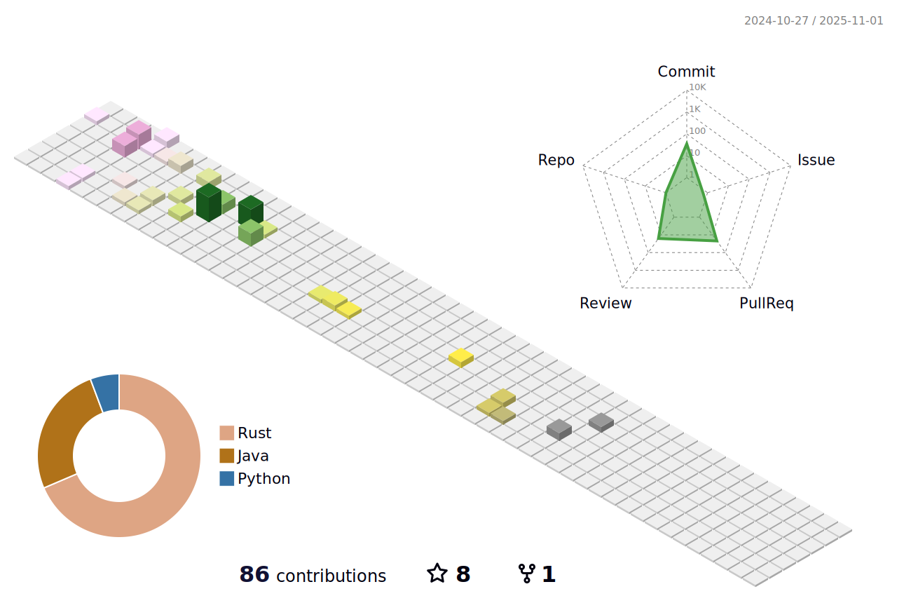

# My ReadMe Profile and If you like it 🌟💕
##  

## Hi there （こんにちわ）from Japan :japan: 

<!--

## 
-->

### Mozilla supporter 

<!--

-->

<!--

-->

 ✨ _special_ ✨ repository because its `README.md` (this file) appears on your GitHub profile.

* [QuickAccess Playground](https://wandbox.org/)

<!--
- 🔭 I’m currently working on ...
- 👯 I’m looking to collaborate on ...
- 🤔 I’m looking for help with ...
- 💬 Ask me about ...
- 😄 Pronouns: ...
- ⚡ Fun fact: ...
-->

- 🌱 I’m currently learning [Scala](https://users.scala-lang.org/u/friendbear), [Rust](https://users.rust-lang.org/u/friendbear), [Python3](https://pypi.org/user/friendbear) C, C++, .NET and Bigdata, [MongoDB](https://www.mongodb.com/community/forums/u/friendbear) ... etc
* 📫 How to reach me: <a href="mailto:friendbear22@gmail.com">friendbear22@gmail.com</a> is.</p>
  * 🔑 GPP Key: None
* ⚡ I'm Join Forums
  * [🦀Rust Language Community](https://users.rust-lang.org/u/friendbear)
  * [Twitter Community Developers](https://twittercommunity.com/u/bearsworld22)
  * [Mongo DB Community](https://www.mongodb.com/community/forums/u/friendbear)
  * [Home assistant Community](https://community.home-assistant.io/u/friendbear)

---

<a href="https://github.com/sponsors/friendbear" title="Sponsor T Kumagai"></a>

---

### Usefull Links

* [GitHub Markdown Reference](https://github.github.com/gfm/)
* [Open Lab](https://openlab.ncl.ac.uk/)
* [Jupyter](https://jupyter.org/)

### My links

* [Mozilla](https://support.mozilla.org/en-US/user/friendbear)
* [IEEE](https://spectrum.ieee.org/u/tomohiro_kumagai)
* [LFX](https://openprofile.dev/profile/friendbear)
* [codepen](https://codepen.io/friendbear)
* [Jira](https://friendbear.atlassian.net)
* [StackShare](https://stackshare.io/friendbear)
* [Coudcast](https://www.crowdcast.io/friendbear)
* [MyDagsHub](https://dagshub.com/friendbear) 
* [ProductHunt](https://www.producthunt.com/@friendbear)
* host: <https://vercel.com/friendbear>

### Trading Profile

* [MQL5](https://www.mql5.com/ja/users/friendbear)

### Web3 My Profile

* [Getcoin](https://gitcoin.co/friendbear)
* [OpenSea](https://opensea.com/friendbear)

---

### Activity

[](https://github.com/friendbear/friendbear/actions/workflows/cronjob-wakatime-generater.yml)

---

<!--START_SECTION:waka-->

```txt
From: 14 December 2024 - To: 21 December 2024

Other   2 hrs 12 mins   >>>>>>>>>>>>>>>>>>>>>>>>-   97.77 %
Rust    3 mins          >------------------------   02.23 %
```

<!--END_SECTION:waka-->

### A little more about me...

<details><summary>Scala 2.2x</summary>
<p>

#### We can hide anything, even code!

```scala
    #!/usr/bin/env amm
    import scala.io.Source

    trait Programmer{def programinng()}
    trait Engineer{def writting()}
    trait Manager{def communication()}
    trait FullstackEnginner { this: Programmer with Engineer with Manager =>
        def superman()
    }
    class AboutMe(name: String, weightScale: Range, likeLocations: List[String], likeLanguages: List[String])
    object AboutMe {
      def printAbout() {
        println("MyName is ${name}")
      }
      def apply(weightScale: Range, likeLocations: List[String], likeLanguages: List[String]): AboutMe =
        AboutMe(weightScale, likeLocations, likeLanguage)
    }

    type ProgramData = (Int, String, String)
    def loadProgramData(): List[ProgramData] = {
      Source.fromFile("program.csv").getLines.drop(1).map(s => {val split = s.split(',');(split(0).toInt, split(1), split(2))}).toList
    }

    @main
    def printMe() {
      val programData = loadProgramData
      val likeLogic = (like: String) => like match {
        case "hybrid" | "oop" | "functional" | "el" => true
        case _ => false
      }
      val likeLocations = List("Kyoto, Japan", "Shimane, 出雲大社", "Etc.")
      val langs = for (programs <- programData.filter(p => likeLogic(p._3)) yield programs._2
      AboutMe.apply(55 to 79, likeLocations, langs).name = "T Kumagai" printAbout
    }
```
</p>
</details>

---

<em><b>I love coffee</b> Since 2021-10: Open ko-fi shop <a href="https://ko-fi.com/friendbear">Please Access My Coffe Shop.</a>
<a href='https://ko-fi.com/friendbear' target='_blank'></a>
</em>

---

### Contributions

(in the last 365 days, languages pie based on number of commits)



---
<!--

## Status

<div align="left">
  
  
  
</div>

pending

  

  
  

[](https://www.instagram.com/inductor.kela) [](https://blog.inductor.me) 
[](https://speakerdeck.com/inductor)
-->

<!--
### Skills

   
-->

<!--
<p align="left">  </p>

<p algin="center">
<a href="https://dev.to/friendbear"> 
</a>
<a href="https://community.codenewbie.org/friendbear">
</a>
&emsp;
<a href="https://friendbear.atlassian.net">
</a>
&emsp;
-->

[twitter]: https://twitter.com/friendbear22
[devdojo]: https://devdojo.com/friendbear
[dev.to]: https://dev.to/friendbear
[linkedin]: https://www.linkedin.com/in/friendbear
[stakoverflow]: https://stackoverflow.com/users/10924993/t-kumagai

[](https://twitter.com/friendbear22)
[](https://twitter.com/bearsworld22)

## daily.dev devcard
<a href="https://app.daily.dev/friendbear"></a>


### daily.dev Bookmarks

<!-- daily.dev BOOKMARKS:START -->
- [Java Roadmap](https://app.daily.dev/posts/l0W41bTi4?utm_source=rss&utm_medium=bookmarks&utm_campaign=l1Q7lMvCD9ALXzxqEPWaM)
- [Best AI Coding Tools for Developers in 2024](https://app.daily.dev/posts/25uiXTRUU?utm_source=rss&utm_medium=bookmarks&utm_campaign=l1Q7lMvCD9ALXzxqEPWaM)
- [Why you should use Rust on the backend](https://app.daily.dev/posts/OrMNgUVQp?utm_source=rss&utm_medium=bookmarks&utm_campaign=l1Q7lMvCD9ALXzxqEPWaM)
- [How to Design Twitter &lpar;X&rpar; in a System Design Interview?](https://app.daily.dev/posts/RgtBHkVyO?utm_source=rss&utm_medium=bookmarks&utm_campaign=l1Q7lMvCD9ALXzxqEPWaM)
- [GitHub Repositories Every Software Engineer Should Know](https://app.daily.dev/posts/cdbXKUYqf?utm_source=rss&utm_medium=bookmarks&utm_campaign=l1Q7lMvCD9ALXzxqEPWaM)
<!-- daily.dev BOOKMARKS:END -->


### Recent GitHub Activity

<!--START_SECTION:activity-->
1. 💪 Opened PR [#13](https://github.com/friendbear/kafka-beginners-course/pull/13) in [friendbear/kafka-beginners-course](https://github.com/friendbear/kafka-beginners-course)
2. 💪 Opened PR [#45](https://github.com/friendbear/kafka-beginners/pull/45) in [friendbear/kafka-beginners](https://github.com/friendbear/kafka-beginners)
3. 🎉 Merged PR [#44](https://github.com/friendbear/kafka-beginners/pull/44) in [friendbear/kafka-beginners](https://github.com/friendbear/kafka-beginners)
4. 🎉 Merged PR [#43](https://github.com/friendbear/kafka-beginners/pull/43) in [friendbear/kafka-beginners](https://github.com/friendbear/kafka-beginners)
5. 🎉 Merged PR [#42](https://github.com/friendbear/kafka-beginners/pull/42) in [friendbear/kafka-beginners](https://github.com/friendbear/kafka-beginners)
6. 🗣 Commented on [#42](https://github.com/friendbear/kafka-beginners/pull/42#issuecomment-2526671158) in [friendbear/kafka-beginners](https://github.com/friendbear/kafka-beginners)
7. 💪 Opened PR [#44](https://github.com/friendbear/kafka-beginners/pull/44) in [friendbear/kafka-beginners](https://github.com/friendbear/kafka-beginners)
8. 💪 Opened PR [#43](https://github.com/friendbear/kafka-beginners/pull/43) in [friendbear/kafka-beginners](https://github.com/friendbear/kafka-beginners)
9. 💪 Opened PR [#42](https://github.com/friendbear/kafka-beginners/pull/42) in [friendbear/kafka-beginners](https://github.com/friendbear/kafka-beginners)
10. 🎉 Merged PR [#39](https://github.com/friendbear/kafka-beginners/pull/39) in [friendbear/kafka-beginners](https://github.com/friendbear/kafka-beginners)

<details><summary>Show More</summary>

`[01/30 09:38]`  Made `2` commits in [friendbear/iriam-event](https://github.com/friendbear/iriam-event)  
`[01/30 09:38]`  Merged PR [`#1`](https://github.com//friendbear/iriam-event/pull/1 'Bump bumpalo from 3.8.0 to 3.12.0') in [friendbear/iriam-event](https://github.com/friendbear/iriam-event)  
`[01/30 09:33]`  Deleted `dependabot/pip/certifi-2023.7.22` from [friendbear/youtube-box](https://github.com/friendbear/youtube-box)  
`[01/30 09:33]`  Made `2` commits in [friendbear/youtube-box](https://github.com/friendbear/youtube-box)  
`[01/30 09:33]`  Merged PR [`#4`](https://github.com//friendbear/youtube-box/pull/4 'Bump certifi from 2020.4.5.1 to 2023.7.22') in [friendbear/youtube-box](https://github.com/friendbear/youtube-box)  
`[01/30 07:06]`  Made `4` commits in [cruise-group/write-hello-world-from-any-language-in-the-rust](https://github.com/cruise-group/write-hello-world-from-any-language-in-the-rust)  
`[01/29 11:17]`  Merged PR [`#2`](https://github.com//cruise-group/write-hello-world-from-any-language-in-the-rust/pull/2 'MyStruct uses named fields') in [cruise-group/write-hello-world-from-any-language-in-the-rust](https://github.com/cruise-group/write-hello-world-from-any-language-in-the-rust)  
`[01/29 11:12]`  Commented on [`#2`](https://github.com//cruise-group/write-hello-world-from-any-language-in-the-rust/issues/2 'MyStruct uses named fields') in [cruise-group/write-hello-world-from-any-language-in-the-rust](https://github.com/cruise-group/write-hello-world-from-any-language-in-the-rust)  
`[01/29 06:35]`  Made `2` commits in [cruise-group/write-hello-world-from-any-language-in-the-rust](https://github.com/cruise-group/write-hello-world-from-any-language-in-the-rust)  
`[01/27 09:41]`  Made `1` commit in [friendbear/programming-rust](https://github.com/friendbear/programming-rust)  
`[01/25 16:40]`  Starred [simple-login/app](https://github.com/simple-login/app)  
`[01/24 15:40]`  Starred [webpro/dotfiles](https://github.com/webpro/dotfiles)  
`[01/24 15:34]`  Forked [webpro/awesome-dotfiles](https://github.com/webpro/awesome-dotfiles) to [friendbear/awesome-dotfiles](https://github.com/friendbear/awesome-dotfiles)  
`[01/24 15:33]`  Starred [webpro/awesome-dotfiles](https://github.com/webpro/awesome-dotfiles)  
`[01/23 10:01]`  Starred [EricGuo5513/momask-codes](https://github.com/EricGuo5513/momask-codes)  
`[01/23 08:59]`  Starred [samuelmtimbo/unit](https://github.com/samuelmtimbo/unit)  
`[01/22 20:15]`  Made `1` commit in [cruise-group/write-hello-world-from-any-language-in-the-rust](https://github.com/cruise-group/write-hello-world-from-any-language-in-the-rust)  
`[01/22 20:04]`  Made `1` commit in [cruise-group/write_hello_world_from_any_language_in_the_rust](https://github.com/cruise-group/write_hello_world_from_any_language_in_the_rust)  
`[01/22 20:01]`  Created branch [`main`](https://github.com/cruise-group/write_hello_world_from_any_language_in_the_rust/tree/main) in [cruise-group/write_hello_world_from_any_language_in_the_rust](https://github.com/cruise-group/write_hello_world_from_any_language_in_the_rust)  
`[01/22 20:01]`  Created repository [cruise-group/write_hello_world_from_any_language_in_the_rust](https://github.com/cruise-group/write_hello_world_from_any_language_in_the_rust)  
`[01/22 19:31]`  Deleted `friendbear-patch-2` from [friendbear/perfect-rust](https://github.com/friendbear/perfect-rust)  
`[01/22 19:31]`  Made `2` commits in [friendbear/perfect-rust](https://github.com/friendbear/perfect-rust)  
`[01/22 19:31]`  Merged PR [`#112`](https://github.com//friendbear/perfect-rust/pull/112 'Update README.md') in [friendbear/perfect-rust](https://github.com/friendbear/perfect-rust)  
`[01/22 19:31]`  Opened PR [`#112`](https://github.com//friendbear/perfect-rust/pull/112 'Update README.md') in [friendbear/perfect-rust](https://github.com/friendbear/perfect-rust)  
`[01/22 19:31]`  Created branch [`friendbear-patch-2`](https://github.com/friendbear/perfect-rust/tree/friendbear-patch-2) in [friendbear/perfect-rust](https://github.com/friendbear/perfect-rust)  
`[01/22 15:17]`  Starred [cruise-group/discussion](https://github.com/cruise-group/discussion)  
`[01/22 15:11]`  Made `35` commits in [friendbear/perfect-rust](https://github.com/friendbear/perfect-rust)  
`[01/22 15:09]`  Created branch [`friendbear-patch-3`](https://github.com/friendbear/perfect-rust/tree/friendbear-patch-3) in [friendbear/perfect-rust](https://github.com/friendbear/perfect-rust)  
`[01/22 15:09]`  Deleted `friendbear-patch-3` from [friendbear/perfect-rust](https://github.com/friendbear/perfect-rust)  
`[01/22 15:09]`  Made `2` commits in [friendbear/perfect-rust](https://github.com/friendbear/perfect-rust)  
`[01/22 15:09]`  Merged PR [`#110`](https://github.com//friendbear/perfect-rust/pull/110 'Create jekyll-docker.yml') in [friendbear/perfect-rust](https://github.com/friendbear/perfect-rust)  
`[01/22 15:09]`  Opened PR [`#110`](https://github.com//friendbear/perfect-rust/pull/110 'Create jekyll-docker.yml') in [friendbear/perfect-rust](https://github.com/friendbear/perfect-rust)  
`[01/22 15:09]`  Deleted `friendbear-patch-2` from [friendbear/perfect-rust](https://github.com/friendbear/perfect-rust)  
`[01/22 15:09]`  Made `2` commits in [friendbear/perfect-rust](https://github.com/friendbear/perfect-rust)  
`[01/22 15:09]`  Merged PR [`#109`](https://github.com//friendbear/perfect-rust/pull/109 'Create FUNDING.yml') in [friendbear/perfect-rust](https://github.com/friendbear/perfect-rust)  
`[01/22 15:08]`  Opened PR [`#109`](https://github.com//friendbear/perfect-rust/pull/109 'Create FUNDING.yml') in [friendbear/perfect-rust](https://github.com/friendbear/perfect-rust)  
`[01/22 15:01]`  Created branch [`friendbear-patch-3`](https://github.com/friendbear/perfect-rust/tree/friendbear-patch-3) in [friendbear/perfect-rust](https://github.com/friendbear/perfect-rust)  
`[01/22 14:53]`  Created branch [`friendbear-patch-2`](https://github.com/friendbear/perfect-rust/tree/friendbear-patch-2) in [friendbear/perfect-rust](https://github.com/friendbear/perfect-rust)  
`[01/22 14:49]`  Made `30` commits in [friendbear/perfect-rust](https://github.com/friendbear/perfect-rust)  
`[01/22 14:49]`  Merged PR [`#89`](https://github.com//friendbear/perfect-rust/pull/89 'Develop') in [friendbear/perfect-rust](https://github.com/friendbear/perfect-rust)  
`[01/22 14:39]`  Made `7` commits in [friendbear/perfect-rust](https://github.com/friendbear/perfect-rust)  
`[01/22 09:36]`  Starred [githubnext/githubnext](https://github.com/githubnext/githubnext)  
`[01/21 20:59]`  Created branch [`main`](https://github.com/friendbear/skills-introduction-to-github/tree/main) in [friendbear/skills-introduction-to-github](https://github.com/friendbear/skills-introduction-to-github)  
`[01/21 20:59]`  Created repository [friendbear/skills-introduction-to-github](https://github.com/friendbear/skills-introduction-to-github)  
`[01/21 20:58]`  Created branch [`main`](https://github.com/cruise-group/skills-introduction-to-github/tree/main) in [cruise-group/skills-introduction-to-github](https://github.com/cruise-group/skills-introduction-to-github)  
`[01/21 20:58]`  Created repository [cruise-group/skills-introduction-to-github](https://github.com/cruise-group/skills-introduction-to-github)  
`[01/21 19:30]`  Starred [BetterDiscord/BetterDiscord](https://github.com/BetterDiscord/BetterDiscord)  
`[01/20 18:51]`  Starred [Merkie/freespeech](https://github.com/Merkie/freespeech)  
`[01/20 06:05]`  Starred [mozilla/platform-tilt](https://github.com/mozilla/platform-tilt)  
`[01/19 16:32]`  Made `2` commits in [friendbear/friendbear](https://github.com/friendbear/friendbear)  
`[01/19 14:55]`  Forked [themeselection/materio-vuetify-nuxtjs-admin-template-free](https://github.com/themeselection/materio-vuetify-nuxtjs-admin-template-free) to [friendbear/materio-vuetify-nuxtjs-admin-template-free](https://github.com/friendbear/materio-vuetify-nuxtjs-admin-template-free)  
`[01/19 14:54]`  Starred [themeselection/materio-vuetify-nuxtjs-admin-template-free](https://github.com/themeselection/materio-vuetify-nuxtjs-admin-template-free)  
`[01/18 19:34]`  Forked [maybe-finance/maybe](https://github.com/maybe-finance/maybe) to [friendbear/maybe](https://github.com/friendbear/maybe)  
`[01/18 19:31]`  Starred [maybe-finance/maybe](https://github.com/maybe-finance/maybe)  
`[01/18 18:39]`  Made `3` commits in [friendbear/perfect-rust](https://github.com/friendbear/perfect-rust)  
`[01/18 18:25]`  Reviewed [`#89`](https://github.com//friendbear/perfect-rust/pull/89 'Develop') in [friendbear/perfect-rust](https://github.com/friendbear/perfect-rust)  
`[01/18 18:25]`  Reviewed [`#89`](https://github.com//friendbear/perfect-rust/pull/89 'Develop') in [friendbear/perfect-rust](https://github.com/friendbear/perfect-rust)  
`[01/18 18:12]`  Made `1` commit in [friendbear/perfect-rust](https://github.com/friendbear/perfect-rust)  
`[01/18 13:21]`  Made `2` commits in [friendbear/the-book-of-secret-knowledge](https://github.com/friendbear/the-book-of-secret-knowledge)  
`[01/16 08:12]`  Starred [wakatime/discord-wakatime](https://github.com/wakatime/discord-wakatime)  
`[01/16 05:14]`  Starred [mastodon/mastodon-ios](https://github.com/mastodon/mastodon-ios)  
`[01/16 05:07]`  Starred [home-assistant/core](https://github.com/home-assistant/core)  
`[01/12 13:17]`  Starred [ckaznable/poketex](https://github.com/ckaznable/poketex)  
`[01/10 12:41]`  Starred [rust-embedded/embedded-hal](https://github.com/rust-embedded/embedded-hal)  
`[01/05 15:59]`  Starred [golemparts/rppal](https://github.com/golemparts/rppal)  
`[12/26 16:39]`  Starred [RaspAP/raspap-webgui](https://github.com/RaspAP/raspap-webgui)  
`[12/26 16:37]`  Starred [RaspAP/raspap-docker](https://github.com/RaspAP/raspap-docker)  
`[12/26 15:57]`  Starred [hoalongnatsu/Dockerfile](https://github.com/hoalongnatsu/Dockerfile)  
`[12/26 00:39]`  Forked [trimstray/the-book-of-secret-knowledge](https://github.com/trimstray/the-book-of-secret-knowledge) to [friendbear/the-book-of-secret-knowledge](https://github.com/friendbear/the-book-of-secret-knowledge)  
`[12/25 12:43]`  Starred [trimstray/the-book-of-secret-knowledge](https://github.com/trimstray/the-book-of-secret-knowledge)  
`[12/16 10:08]`  Starred [folke/lazy.nvim](https://github.com/folke/lazy.nvim)  
`[12/16 09:53]`  Starred [epwalsh/obsidian.nvim](https://github.com/epwalsh/obsidian.nvim)  
`[12/16 06:08]`  Starred [httpie/desktop](https://github.com/httpie/desktop)  
`[12/14 19:34]`  Starred [cloudflare/workers-sdk](https://github.com/cloudflare/workers-sdk)  
`[12/14 19:31]`  Starred [cloudflare/workers-rs](https://github.com/cloudflare/workers-rs)  
`[12/14 19:30]`  Starred [cloudflare/cloudflare-docs](https://github.com/cloudflare/cloudflare-docs)  
`[12/14 13:51]`  Commented on [`#98`](https://github.com//friendbear/perfect-rust/issues/98 '[clippy::redundant-closure] redundant_closure') in [friendbear/perfect-rust](https://github.com/friendbear/perfect-rust)  
`[12/13 18:11]`  Opened issue [`#98`](https://github.com//friendbear/perfect-rust/issues/98 '[clippy::redundant-closure] redundant_closure') in [friendbear/perfect-rust](https://github.com/friendbear/perfect-rust)  
`[12/13 17:34]`  Made `6` commits in [friendbear/perfect-rust](https://github.com/friendbear/perfect-rust)  
`[12/13 15:19]`  Reopened issue [`#3`](https://github.com//friendbear/perfect-rust/issues/3 '変数と定数') in [friendbear/perfect-rust](https://github.com/friendbear/perfect-rust)  
`[12/13 15:19]`  Reopened issue [`#6`](https://github.com//friendbear/perfect-rust/issues/6 '基本データ型') in [friendbear/perfect-rust](https://github.com/friendbear/perfect-rust)  
`[12/13 15:18]`  Reopened issue [`#8`](https://github.com//friendbear/perfect-rust/issues/8 '制御式') in [friendbear/perfect-rust](https://github.com/friendbear/perfect-rust)  
`[12/13 15:18]`  Reopened issue [`#12`](https://github.com//friendbear/perfect-rust/issues/12 'ライブラリのデータ型') in [friendbear/perfect-rust](https://github.com/friendbear/perfect-rust)  
`[12/13 15:18]`  Reopened issue [`#14`](https://github.com//friendbear/perfect-rust/issues/14 '関数') in [friendbear/perfect-rust](https://github.com/friendbear/perfect-rust)  
`[12/13 15:18]`  Reopened issue [`#20`](https://github.com//friendbear/perfect-rust/issues/20 '構造体') in [friendbear/perfect-rust](https://github.com/friendbear/perfect-rust)  
`[12/13 15:18]`  Reopened issue [`#23`](https://github.com//friendbear/perfect-rust/issues/23 'ÂàóÊåôÂûã') in [friendbear/perfect-rust](https://github.com/friendbear/perfect-rust)  
`[12/13 15:17]`  Reopened issue [`#32`](https://github.com//friendbear/perfect-rust/issues/32 'エラー') in [friendbear/perfect-rust](https://github.com/friendbear/perfect-rust)  
`[12/13 15:16]`  Created branch [`main`](https://github.com/cruise-group/my-rust-version-hello-world/tree/main) in [cruise-group/my-rust-version-hello-world](https://github.com/cruise-group/my-rust-version-hello-world)  
`[12/13 15:16]`  Created repository [cruise-group/my-rust-version-hello-world](https://github.com/cruise-group/my-rust-version-hello-world)  
`[12/12 11:13]`  Made `2` commits in [friendbear/friendbear](https://github.com/friendbear/friendbear)  
`[12/11 11:00]`  Forked [planetscale/beam](https://github.com/planetscale/beam) to [friendbear/beam](https://github.com/friendbear/beam)  
`[12/11 10:59]`  Starred [planetscale/beam](https://github.com/planetscale/beam)  
`[12/10 17:29]`  Made `4` commits in [friendbear/nnstreamer](https://github.com/friendbear/nnstreamer)  
`[12/10 15:59]`  Created branch [`patch-1`](https://github.com/friendbear/nnstreamer/tree/patch-1) in [friendbear/nnstreamer](https://github.com/friendbear/nnstreamer)  
`[12/10 15:59]`  Forked [nnstreamer/nnstreamer](https://github.com/nnstreamer/nnstreamer) to [friendbear/nnstreamer](https://github.com/friendbear/nnstreamer)  
`[12/10 13:26]`  Starred [sqlparser-rs/sqlparser-rs](https://github.com/sqlparser-rs/sqlparser-rs)  
`[12/09 18:45]`  Starred [d-kuro/d-kuro.github.io](https://github.com/d-kuro/d-kuro.github.io)  
`[12/09 18:31]`  Made `3` commits in [friendbear/friendbear](https://github.com/friendbear/friendbear)  
`[12/09 17:34]`  Deleted `friendbear-patch-2` from [friendbear/perfect-rust](https://github.com/friendbear/perfect-rust)  
`[12/09 17:34]`  Made `28` commits in [friendbear/perfect-rust](https://github.com/friendbear/perfect-rust)  
`[12/09 17:34]`  Merged PR [`#97`](https://github.com//friendbear/perfect-rust/pull/97 'Friendbear patch 2') in [friendbear/perfect-rust](https://github.com/friendbear/perfect-rust)  
`[12/09 17:34]`  Made `10` commits in [friendbear/perfect-rust](https://github.com/friendbear/perfect-rust)  
`[12/09 13:58]`  Opened PR [`#97`](https://github.com//friendbear/perfect-rust/pull/97 'Friendbear patch 2') in [friendbear/perfect-rust](https://github.com/friendbear/perfect-rust)  
`[12/09 13:57]`  Created branch [`friendbear-patch-2`](https://github.com/friendbear/perfect-rust/tree/friendbear-patch-2) in [friendbear/perfect-rust](https://github.com/friendbear/perfect-rust)  
`[12/09 12:32]`  Starred [mjl-/mox](https://github.com/mjl-/mox)  
`[12/08 15:55]`  Starred [rust-lang/cargo](https://github.com/rust-lang/cargo)  
`[12/07 18:49]`  Made `1` commit in [friendbear/perfect-rust](https://github.com/friendbear/perfect-rust)  
`[12/07 16:52]`  Opened issue [`#3`](https://github.com//neerajbg/rust-student-mini-project/issues/3 'Personal Thoughts') in [neerajbg/rust-student-mini-project](https://github.com/neerajbg/rust-student-mini-project)  
`[12/07 14:01]`  Made `1` commit in [friendbear/perfect-rust](https://github.com/friendbear/perfect-rust)  
`[12/07 07:57]`  Starred [allan2/dotenvy](https://github.com/allan2/dotenvy)  
`[12/07 04:34]`  Starred [Shriinivas/blenderbezierutils](https://github.com/Shriinivas/blenderbezierutils)  
`[12/06 02:17]`  Starred [LinkStackOrg/LinkStack](https://github.com/LinkStackOrg/LinkStack)  
`[12/06 02:16]`  Forked [LinkStackOrg/LinkStack](https://github.com/LinkStackOrg/LinkStack) to [friendbear/LinkStack](https://github.com/friendbear/LinkStack)  
`[12/06 02:15]`  Starred [LinkStackOrg/Cloudy-Storm-1k-edition](https://github.com/LinkStackOrg/Cloudy-Storm-1k-edition)  
`[12/05 15:16]`  Starred [magic-research/magic-animate](https://github.com/magic-research/magic-animate)  
`[12/05 13:54]`  Starred [ekzhang/bore](https://github.com/ekzhang/bore)  
`[12/05 13:52]`  Starred [ekzhang/percival](https://github.com/ekzhang/percival)  
`[12/05 13:51]`  Starred [ekzhang/rustpad](https://github.com/ekzhang/rustpad)  
`[12/05 13:47]`  Starred [ekzhang/sshx](https://github.com/ekzhang/sshx)  
`[12/03 07:23]`  Starred [vercel/turbo](https://github.com/vercel/turbo)  
`[12/01 17:05]`  Starred [twitter/communitynotes](https://github.com/twitter/communitynotes)  
`[12/01 01:51]`  Forked [HumanAIGC/AnimateAnyone](https://github.com/HumanAIGC/AnimateAnyone) to [friendbear/AnimateAnyone](https://github.com/friendbear/AnimateAnyone)  
`[11/30 12:06]`  Made `1` commit in [friendbear/black-list-html](https://github.com/friendbear/black-list-html)  
`[11/30 12:03]`  Created branch [`main`](https://github.com/friendbear/black-list-html/tree/main) in [friendbear/black-list-html](https://github.com/friendbear/black-list-html)  
`[11/30 12:03]`  Created repository [friendbear/black-list-html](https://github.com/friendbear/black-list-html)  
`[11/30 05:56]`  Forked [eliahuhorwitz/Academic-project-page-template](https://github.com/eliahuhorwitz/Academic-project-page-template) to [friendbear/Academic-project-page-template](https://github.com/friendbear/Academic-project-page-template)  
`[11/30 05:54]`  Starred [eliahuhorwitz/Academic-project-page-template](https://github.com/eliahuhorwitz/Academic-project-page-template)  
`[11/30 05:48]`  Starred [HumanAIGC/AnimateAnyone](https://github.com/HumanAIGC/AnimateAnyone)  
`[11/30 04:02]`  Opened issue [`#3`](https://github.com//kaiwaehner/python-jupyter-apache-kafka-ksql-tensorflow-keras/issues/3 'What is this?') in [kaiwaehner/python-jupyter-apache-kafka-ksql-tensorflow-keras](https://github.com/kaiwaehner/python-jupyter-apache-kafka-ksql-tensorflow-keras)  
`[11/30 01:29]`  Forked [jaywcjlove/awesome-mac](https://github.com/jaywcjlove/awesome-mac) to [friendbear/awesome-mac](https://github.com/friendbear/awesome-mac)  
`[11/30 01:04]`  Starred [Shikkic/gitbar](https://github.com/Shikkic/gitbar)  
`[11/29 09:15]`  Forked [kaiwaehner/python-jupyter-apache-kafka-ksql-tensorflow-keras](https://github.com/kaiwaehner/python-jupyter-apache-kafka-ksql-tensorflow-keras) to [friendbear/python-jupyter-apache-kafka-ksql-tensorflow-keras](https://github.com/friendbear/python-jupyter-apache-kafka-ksql-tensorflow-keras)  
`[11/29 09:14]`  Starred [kaiwaehner/python-jupyter-apache-kafka-ksql-tensorflow-keras](https://github.com/kaiwaehner/python-jupyter-apache-kafka-ksql-tensorflow-keras)  
`[11/28 16:04]`  Starred [ButzYung/SystemAnimatorOnline](https://github.com/ButzYung/SystemAnimatorOnline)  
`[11/28 15:30]`  Deleted `add-code-of-conduct-1` from [friendbear/friendbear](https://github.com/friendbear/friendbear)  
`[11/28 15:30]`  Made `2` commits in [friendbear/friendbear](https://github.com/friendbear/friendbear)  
`[11/28 15:30]`  Merged PR [`#7`](https://github.com//friendbear/friendbear/pull/7 'Create CODE_OF_CONDUCT.md') in [friendbear/friendbear](https://github.com/friendbear/friendbear)  
`[11/28 14:24]`  Forked [nrc/rustaceans.org](https://github.com/nrc/rustaceans.org) to [friendbear/rustaceans.org](https://github.com/friendbear/rustaceans.org)  
`[11/28 14:20]`  Starred [nrc/rustaceans.org](https://github.com/nrc/rustaceans.org)  
`[11/28 04:10]`  Starred [GhostCatcg/3d-earth](https://github.com/GhostCatcg/3d-earth)  
`[11/28 03:07]`  Forked [hashicorp/tfc-workflows-tooling](https://github.com/hashicorp/tfc-workflows-tooling) to [friendbear/tfc-workflows-tooling](https://github.com/friendbear/tfc-workflows-tooling)  
`[11/28 02:56]`  Forked [samuellee-zy/tfc-cicd-demo](https://github.com/samuellee-zy/tfc-cicd-demo) to [friendbear/tfc-cicd-demo](https://github.com/friendbear/tfc-cicd-demo)  
`[11/28 02:56]`  Starred [samuellee-zy/tfc-cicd-demo](https://github.com/samuellee-zy/tfc-cicd-demo)  
`[11/28 02:56]`  Starred [hashicorp/tfc-workflows-tooling](https://github.com/hashicorp/tfc-workflows-tooling)  
`[11/27 17:10]`  Forked [joleaf/obsidian-email-block-plugin](https://github.com/joleaf/obsidian-email-block-plugin) to [friendbear/obsidian-email-block-plugin](https://github.com/friendbear/obsidian-email-block-plugin)  
`[11/27 17:07]`  Starred [joleaf/obsidian-email-block-plugin](https://github.com/joleaf/obsidian-email-block-plugin)  
`[11/27 08:37]`  Forked [mozilla/hubs-cloud](https://github.com/mozilla/hubs-cloud) to [friendbear/hubs-cloud](https://github.com/friendbear/hubs-cloud)  
`[11/26 05:03]`  Starred [kaiwaehner/ksql-udf-deep-learning-mqtt-iot](https://github.com/kaiwaehner/ksql-udf-deep-learning-mqtt-iot)  
`[11/26 04:30]`  Starred [Swordfish90/cool-retro-term](https://github.com/Swordfish90/cool-retro-term)  
`[11/25 06:46]`  Starred [se2p/LitterBox](https://github.com/se2p/LitterBox)  
`[11/25 06:44]`  Starred [microsoft/inshellisense](https://github.com/microsoft/inshellisense)  
`[11/25 06:24]`  Made `3` commits in [friendbear/safe-zero-copy-parsers-rust-lang-ver](https://github.com/friendbear/safe-zero-copy-parsers-rust-lang-ver)  
`[11/25 06:16]`  Created branch [`main`](https://github.com/friendbear/safe-zero-copy-parsers-rust-lang-ver/tree/main) in [friendbear/safe-zero-copy-parsers-rust-lang-ver](https://github.com/friendbear/safe-zero-copy-parsers-rust-lang-ver)  
`[11/25 06:16]`  Created repository [friendbear/safe-zero-copy-parsers-rust-lang-ver](https://github.com/friendbear/safe-zero-copy-parsers-rust-lang-ver)  
`[11/25 06:15]`  Made `5` commits in [friendbear/safe-zero-copy-parsers-c-lang-ver](https://github.com/friendbear/safe-zero-copy-parsers-c-lang-ver)  
`[11/25 05:05]`  Created branch [`main`](https://github.com/friendbear/safe-zero-copy-parsers-c-lang-ver/tree/main) in [friendbear/safe-zero-copy-parsers-c-lang-ver](https://github.com/friendbear/safe-zero-copy-parsers-c-lang-ver)  
`[11/25 05:05]`  Created repository [friendbear/safe-zero-copy-parsers-c-lang-ver](https://github.com/friendbear/safe-zero-copy-parsers-c-lang-ver)  
`[11/24 19:24]`  Made `1` commit in [cruise-group/discussion](https://github.com/cruise-group/discussion)  
`[11/24 18:35]`  Starred [obsidianmd/obsidian-sample-plugin](https://github.com/obsidianmd/obsidian-sample-plugin)  
`[11/24 18:34]`  Starred [obsidianmd/obsidian-releases](https://github.com/obsidianmd/obsidian-releases)  
`[11/24 16:59]`  Starred [ClarkAllen1556/obsidian_clip](https://github.com/ClarkAllen1556/obsidian_clip)  
`[11/24 01:24]`  Made `1` commit in [friendbear/friendbear](https://github.com/friendbear/friendbear)  
`[11/23 07:02]`  Starred [kukai-wallet/kukai](https://github.com/kukai-wallet/kukai)  
`[11/23 03:40]`  Made `2` commits in [friendbear/friendbear](https://github.com/friendbear/friendbear)  
`[11/22 14:11]`  Starred [amazeeio/opensearch-image](https://github.com/amazeeio/opensearch-image)  
`[11/22 14:10]`  Starred [amazeeio/mkdocs-material](https://github.com/amazeeio/mkdocs-material)  
`[11/22 06:37]`  Starred [zenn-dev/google-cloud-workshop-202311-xenn](https://github.com/zenn-dev/google-cloud-workshop-202311-xenn)  
`[11/22 02:30]`  Starred [mdn/mdn](https://github.com/mdn/mdn)  
`[11/22 02:23]`  Commented on [`#8`](https://github.com//friendbear/friendbear/issues/8 'Update CRITATION(.crf)') in [friendbear/friendbear](https://github.com/friendbear/friendbear)  
`[11/22 02:19]`  Starred [support-project/knowledge](https://github.com/support-project/knowledge)  
`[11/21 08:29]`  Starred [ORCID/orcid-api-tutorial](https://github.com/ORCID/orcid-api-tutorial)  
`[11/21 07:25]`  Starred [Textualize/textual](https://github.com/Textualize/textual)  
`[11/20 13:17]`  Commented on [`#96`](https://github.com//kazuki0824/recisdb-rs/issues/96 '[QUESTION] Intel macOS 13.6.1 において実行に必要なライブラリの場所をご教授いただけませんでしょうか。') in [kazuki0824/recisdb-rs](https://github.com/kazuki0824/recisdb-rs)  
`[11/20 13:06]`  Starred [motdotla/dotenv](https://github.com/motdotla/dotenv)  
`[11/20 10:08]`  Made `2` commits in [friendbear/friendbear](https://github.com/friendbear/friendbear)  
`[11/19 09:03]`  Starred [githubnext/hello-world](https://github.com/githubnext/hello-world)  
`[11/19 08:13]`  Made `1` commit in [cruise-group/discussion](https://github.com/cruise-group/discussion)  
`[11/19 08:12]`  Made `1` commit in [cruise-group/discussions](https://github.com/cruise-group/discussions)  
`[11/17 23:54]`  Made `2` commits in [cruise-group/.github](https://github.com/cruise-group/.github)  
`[11/17 09:04]`  Created branch [`main`](https://github.com/cruise-group/discussions/tree/main) in [cruise-group/discussions](https://github.com/cruise-group/discussions)  
`[11/17 09:04]`  Created repository [cruise-group/discussions](https://github.com/cruise-group/discussions)  
`[11/17 09:00]`  Commented on [`#1108`](https://github.com//Rigellute/spotify-tui/issues/1108 'cargo install soptify-tui failed.') in [Rigellute/spotify-tui](https://github.com/Rigellute/spotify-tui)  
`[11/17 08:45]`  Closed issue [`#1108`](https://github.com//Rigellute/spotify-tui/issues/1108 'cargo install soptify-tui failed.') in [Rigellute/spotify-tui](https://github.com/Rigellute/spotify-tui)  
`[11/17 08:45]`  Commented on [`#1108`](https://github.com//Rigellute/spotify-tui/issues/1108 'cargo install soptify-tui failed.') in [Rigellute/spotify-tui](https://github.com/Rigellute/spotify-tui)  
`[11/17 08:31]`  Starred [aome510/spotify-player](https://github.com/aome510/spotify-player)  
`[11/17 05:48]`  Commented on [`#1108`](https://github.com//Rigellute/spotify-tui/issues/1108 'cargo install soptify-tui failed.') in [Rigellute/spotify-tui](https://github.com/Rigellute/spotify-tui)  
`[11/17 05:42]`  Opened issue [`#1108`](https://github.com//Rigellute/spotify-tui/issues/1108 'cargo install soptify-tui failed.') in [Rigellute/spotify-tui](https://github.com/Rigellute/spotify-tui)  
`[11/17 03:39]`  Starred [o8vm/octox](https://github.com/o8vm/octox)  
`[11/17 01:49]`  Starred [openchatai/OpenCopilot](https://github.com/openchatai/OpenCopilot)  
`[11/16 08:37]`  Commented on [`#96`](https://github.com//kazuki0824/recisdb-rs/issues/96 '[QUESTION] Intel macOS 13.6.1 において実行に必要なライブラリの場所をご教授いただけませんでしょうか。') in [kazuki0824/recisdb-rs](https://github.com/kazuki0824/recisdb-rs)  
`[11/16 06:17]`  Opened issue [`#96`](https://github.com//kazuki0824/recisdb-rs/issues/96 '[QUESTION] Intel macOS 13.6.1 において実行に必要なライブラリの場所をご教授いただけませんでしょうか。') in [kazuki0824/recisdb-rs](https://github.com/kazuki0824/recisdb-rs)  
`[11/16 05:37]`  Starred [kazuki0824/recisdb-rs](https://github.com/kazuki0824/recisdb-rs)  
`[11/15 16:17]`  Commented on [`#206`](https://github.com//rust-embedded/rust-raspberrypi-OS-tutorials/issues/206 'Please Change README') in [rust-embedded/rust-raspberrypi-OS-tutorials](https://github.com/rust-embedded/rust-raspberrypi-OS-tutorials)  
`[11/15 16:05]`  Starred [codemountains/mountix-shuttle](https://github.com/codemountains/mountix-shuttle)  
`[11/15 09:02]`  Starred [second-state/microservice-rust-mysql](https://github.com/second-state/microservice-rust-mysql)  
`[11/14 16:28]`  Starred [Vinzent03/obsidian-advanced-uri](https://github.com/Vinzent03/obsidian-advanced-uri)  
`[11/14 13:40]`  Starred [pbzweihander/rust-trending](https://github.com/pbzweihander/rust-trending)  
`[11/14 08:03]`  Opened issue [`#206`](https://github.com//rust-embedded/rust-raspberrypi-OS-tutorials/issues/206 'Please Change README') in [rust-embedded/rust-raspberrypi-OS-tutorials](https://github.com/rust-embedded/rust-raspberrypi-OS-tutorials)  
`[11/14 05:56]`  Starred [mdn/project-template](https://github.com/mdn/project-template)  
`[11/12 17:38]`  Made `4` commits in [cruise-group/.github](https://github.com/cruise-group/.github)  
`[11/11 04:48]`  Created branch [`main`](https://github.com/friendbear/mdn-generated-project-template/tree/main) in [friendbear/mdn-generated-project-template](https://github.com/friendbear/mdn-generated-project-template)  
`[11/11 04:48]`  Created repository [friendbear/mdn-generated-project-template](https://github.com/friendbear/mdn-generated-project-template)  
`[11/11 04:42]`  Starred [mdn/workflows](https://github.com/mdn/workflows)  
`[11/11 04:41]`  Starred [mdn/ai-feedback](https://github.com/mdn/ai-feedback)  
`[11/11 02:51]`  Opened issue [`#1`](https://github.com//fieldville/dotfiles2/issues/1 'Please Write README.md') in [fieldville/dotfiles2](https://github.com/fieldville/dotfiles2)  
`[11/10 23:00]`  Starred [friendbear/perfect-rust](https://github.com/friendbear/perfect-rust)  
`[11/10 22:52]`  Opened PR [`#89`](https://github.com//friendbear/perfect-rust/pull/89 'Develop') in [friendbear/perfect-rust](https://github.com/friendbear/perfect-rust)  
`[11/10 22:46]`  Reviewed [`#85`](https://github.com//friendbear/perfect-rust/pull/85 'Bump sea-orm from 0.12.3 to 0.12.4') in [friendbear/perfect-rust](https://github.com/friendbear/perfect-rust)  
`[11/10 22:45]`  Deleted `dependabot/cargo/futures-util-0.3.29` from [friendbear/perfect-rust](https://github.com/friendbear/perfect-rust)  
`[11/10 22:45]`  Made `2` commits in [friendbear/perfect-rust](https://github.com/friendbear/perfect-rust)  
`[11/10 22:45]`  Merged PR [`#86`](https://github.com//friendbear/perfect-rust/pull/86 'Bump futures-util from 0.3.28 to 0.3.29') in [friendbear/perfect-rust](https://github.com/friendbear/perfect-rust)  
`[11/10 22:45]`  Reviewed [`#86`](https://github.com//friendbear/perfect-rust/pull/86 'Bump futures-util from 0.3.28 to 0.3.29') in [friendbear/perfect-rust](https://github.com/friendbear/perfect-rust)  
`[11/10 22:44]`  Deleted `dependabot/cargo/serde-1.0.192` from [friendbear/perfect-rust](https://github.com/friendbear/perfect-rust)  
`[11/10 22:44]`  Made `2` commits in [friendbear/perfect-rust](https://github.com/friendbear/perfect-rust)  
`[11/10 22:44]`  Merged PR [`#88`](https://github.com//friendbear/perfect-rust/pull/88 'Bump serde from 1.0.188 to 1.0.192') in [friendbear/perfect-rust](https://github.com/friendbear/perfect-rust)  
`[11/10 22:44]`  Reviewed [`#88`](https://github.com//friendbear/perfect-rust/pull/88 'Bump serde from 1.0.188 to 1.0.192') in [friendbear/perfect-rust](https://github.com/friendbear/perfect-rust)  
`[11/10 22:43]`  Reviewed [`#88`](https://github.com//friendbear/perfect-rust/pull/88 'Bump serde from 1.0.188 to 1.0.192') in [friendbear/perfect-rust](https://github.com/friendbear/perfect-rust)  
`[11/10 22:41]`  Made `2` commits in [friendbear/perfect-rust](https://github.com/friendbear/perfect-rust)  
`[11/10 15:59]`  Starred [dougkalash/lanyard-profile-readme](https://github.com/dougkalash/lanyard-profile-readme)  
`[11/10 13:21]`  Made `1` commit in [friendbear/friendbear](https://github.com/friendbear/friendbear)  
`[11/10 13:17]`  Forked [abhisheknaiidu/awesome-github-profile-readme](https://github.com/abhisheknaiidu/awesome-github-profile-readme) to [friendbear/awesome-github-profile-readme](https://github.com/friendbear/awesome-github-profile-readme)  
`[11/09 23:10]`  Starred [githubnext/monaspace](https://github.com/githubnext/monaspace)  
`[11/06 14:15]`  Deleted `dependabot/cargo/proc-macro2-1.0.69` from [friendbear/perfect-rust](https://github.com/friendbear/perfect-rust)  
`[11/06 14:15]`  Made `2` commits in [friendbear/perfect-rust](https://github.com/friendbear/perfect-rust)  
`[11/06 14:15]`  Merged PR [`#78`](https://github.com//friendbear/perfect-rust/pull/78 'Bump proc-macro2 from 1.0.66 to 1.0.69') in [friendbear/perfect-rust](https://github.com/friendbear/perfect-rust)  
`[11/06 14:14]`  Deleted `dependabot/cargo/rustix-0.37.25` from [friendbear/perfect-rust](https://github.com/friendbear/perfect-rust)  

</details>
<!--END_SECTION:activity-->


<!--
### [smile](https://smile.amazon.com/hz/wishlist/ls/ref_=wl_list_url_friends_message>>)

Hi, I was wondering if you had built a list on Amazon. I'd love to see what you really want. Could you share your list with me?--

- Wish List [Amazon US](https://amzn.to/3pukpja)
- Wish List [Amazon JP](https://www.amazon.co.jp/hz/wishlist/ls/35H8D193KCE3O)

Thanks!
T Kumagai

To view and share your lists, visit 

<p align="left">

</p>
-->

<!--
[MyLiving](https://en.wikivoyage.org/wiki/Funabashi)

```geojson
{
  "type": "Point",
  "coordinates": [
    0, 0
  ]
}
```
->

<!-- PayPal Logo <table border="0" cellpadding="10" cellspacing="0" align="left"><tr><td align="center"><a href="#" onclick="javascript:window.open('https://www.paypal.com/jp/webapps/mpp/logo/about','olcwhatispaypal','toolbar=no, location=no, directories=no, status=no, menubar=no, scrollbars=yes, resizable=yes, width=900, height=700');"></a></td></tr></table><!-- PayPal Logo -->
-->

[](https://github.com/friendbear/youtube-box/actions/workflows/main.yml)

[](https://wakatime.com/badge/user/c9dffbdd-c073-4c7d-a529-e105c09c8423/project/2860db9f-388b-400c-95ab-51b00dbf7a82)

😙I love Asuna from SAO. 
